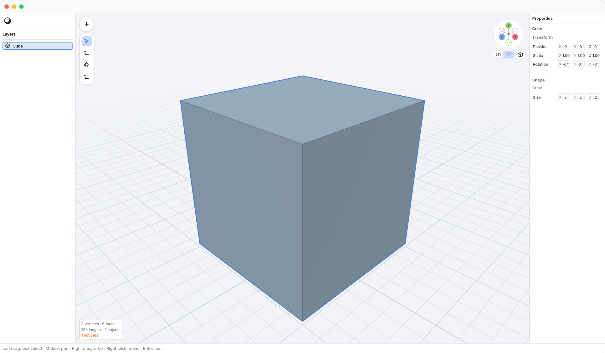

# N3

Nothing graphics editor — 3D.

A minimal mesh editor focused on making hard-surface modeling easier to learn.
Start with a shape, adjust its proportions, and edit its vertices when you need
more control. Place imported assets alongside your geometry and inspect their
materials and motion in the same workspace.

N3 is open source, macOS-first, and in early development.



[User guide](docs/guide/README.md) · [Animated walkthroughs](docs/guide/gizmo.md) ·
[Contributing](CONTRIBUTING.md)

## Shape, explore, refine

- **Start with a shape.** Insert cubes, planes, circles, cylinders, cones, tori,
  spheres, and regular polyhedra. Adjust their dimensions and segment counts in
  Properties. Inspecting or selecting vertices keeps the shape's parameters;
  the first vertex change turns it into a mesh, and Undo restores the parameters.
- **Work directly.** Select objects or visible vertices, then move, rotate, and
  scale with handles, axis constraints, or exact numeric input. Use
  [movement snapping](docs/guide/snapping.md) for clean increments. Preview
  adjustments and undo an accepted edit in one step.
- **Find your bearings.** Navigate with a mouse or Mac trackpad. Drag the axis
  gizmo to orbit, or align to a planar view with rulers. Animated transitions help
  you follow the change in orientation. [Local View](docs/guide/local-view.md)
  isolates selected objects while you work, then returns to the full scene.
- **Keep the workspace simple.** Layers on the left, live properties on the
  right, and modeling tools over the viewport. Resize the panels or hide the
  interface when you want more room. Open Animation or Terminal in the shared
  Tool Dock when you need it; the dock starts closed.
- **Bring assets into your scene.** Place glTF/GLB assets beside native geometry.
  Move, rotate, scale, duplicate, or delete their placed objects with Undo.
  Their internal meshes, materials, and animation remain read-only. Use Material
  Preview for textured PBR materials, Solid for neutral shape inspection, or
  Wireframe for topology.
  [Imported assets guide](docs/guide/scene-viewer.md).
- **Inspect motion.** Explore clip tracks and keys in the animation timeline.
  Play, pause, or scrub to see joints and morph targets animate in the viewport.
  Select keys for inspection without editing them. Playback stays outside the
  document's Undo history. [Animation guide](docs/guide/animation.md).
- **Use a local shell.** Open [Terminal](docs/guide/terminal.md) in the Tool Dock
  to run shell commands with scrollback and a resizable text grid. Its session
  stays alive when you switch panels or close the dock. Shell commands have
  their own effects; N3's Undo does not reverse them.
- **Keep your work readable.** Import OBJ meshes and save editable `.n3.json`
  documents. One document unit is one centimeter; other input and display units
  do not resize the geometry.

The [guide](docs/guide/README.md) includes screenshots and animated tutorials
generated from the application, with visible cursor, key, and gesture cues.

## Try N3

Run N3 from source on macOS. Install Rust through `rustup`, `just` (verified with
1.46.0), and the macOS command-line developer tools. The repository selects Rust
1.98.1 through `rust-toolchain.toml`. From the repository root:

```sh
just run
```

This builds and opens N3 with the bracket sample. Start empty, edit Suzanne,
inspect a textured bottle, or preview a skinned animation:

```sh
just run --empty
just run fixtures/obj/suzanne.obj
just run fixtures/gltf/WaterBottle/glTF-Binary/WaterBottle.glb
just run fixtures/gltf/SimpleSkin/glTF/SimpleSkin.gltf
```

Use **N3 → File → Open…** to replace the current document with an `.n3.json`,
OBJ, glTF, or GLB file. **Import…** adds objects to the current document.
Dropping an `.n3.json` file opens it; dropping an OBJ, glTF, or GLB file imports
it alongside existing objects.

Save with **N3 → File → Save** or **Save as…**. Native `.n3.json` documents
preserve primitive parameters, editable mesh topology, object transforms, and
linked asset references. Imported OBJ geometry becomes editable mesh objects.

Linked source files are not embedded in the saved document. References are
relative to the document when possible, and Save As keeps the same source
origins. Keep the sources and their buffers/textures with your project. A missing
source retains its object in Layers; restore the files and reopen to recover its
preview. Reopening also picks up source changes.

To inspect a file with document editing disabled, launch explicitly in read-only
mode:

```sh
just cargo run --locked -- --read-only fixtures/gltf/WaterBottle/glTF-Binary/WaterBottle.glb
```

Read the illustrated guide in your browser with `just docs` (requires Python 3).
It opens a local preview of the checked-in documentation; press Ctrl-C in the
terminal to stop the server.

## Current scope

N3 currently supports object transforms, vertex editing,
[making a face](docs/guide/make-face.md) from a triangle or a single flat outline,
and explicit [X-ray selection](docs/guide/xray.md). Broader topology tools,
edge/face selection, geometry snapping, and sculpting are future work.
Web support is also deferred.

OBJ import focuses on vertex positions and polygon faces. Materials, textures,
UVs, and authored normals are not preserved, and OBJ export is not implemented.
OBJ coordinates are interpreted as centimeters without an automatic scale guess.
See [format details](docs/development.md#documents-and-imports) before relying on
an import workflow.

glTF/GLB preview supports core metallic-roughness materials, skins, morph targets,
unlit materials, texture transforms, and punctual lights. Source cameras are
retained, while the viewport uses N3's navigation camera. Unsupported required
extensions fail explicitly; unsupported optional extensions produce diagnostics.
Compression and advanced material extensions remain outside the glTF profile.
Asset-content editing, glTF export, and OpenUSD support are deferred. Preview
lighting and transparency have documented limits in the
[rendering profile](docs/architecture/scene-viewer.md#rendering-profile).

The animation timeline inspects imported clips; it does not author tracks or move
keys. Instances of the same source scene share playback. Terminal runs a local
shell and does not provide an N3 scripting API.

## Build with us

N3 is written in Rust with wgpu, winit, and egui. Start with
[contributing](CONTRIBUTING.md) for setup and verification, or
[development](docs/development.md) for commands and format details.

## License

[MIT](LICENSE). Suzanne's upstream provenance and retained license are recorded
in [fixtures/README.md](fixtures/README.md). Khronos glTF samples retain their
licenses and pinned provenance in [fixtures/gltf](fixtures/gltf/README.md).
