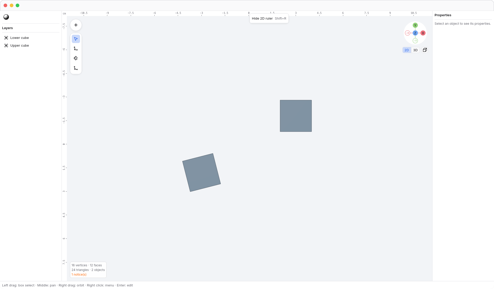
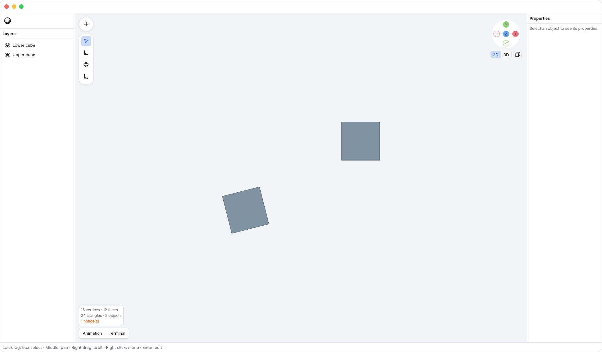
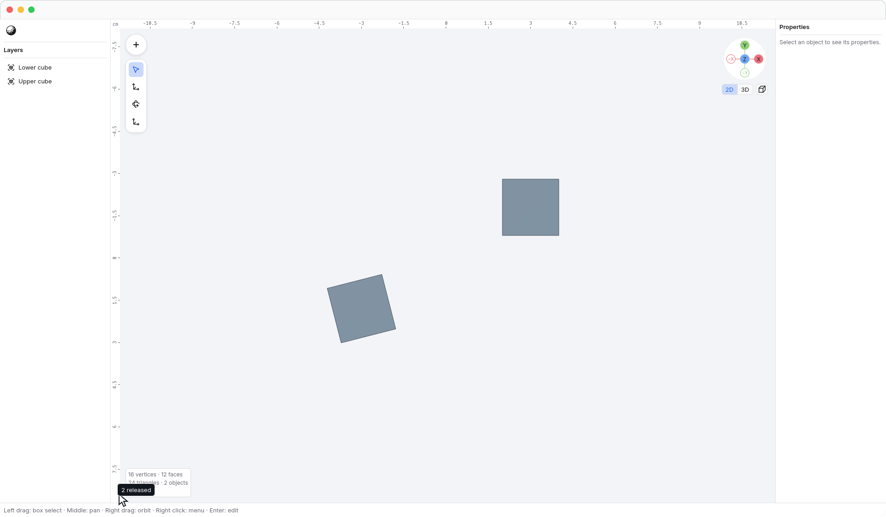
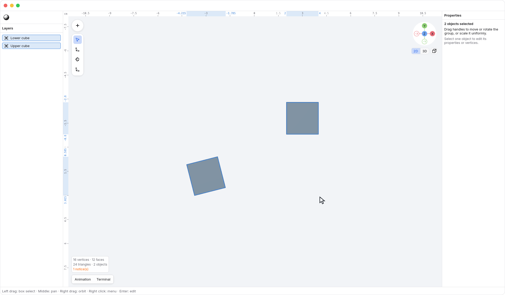
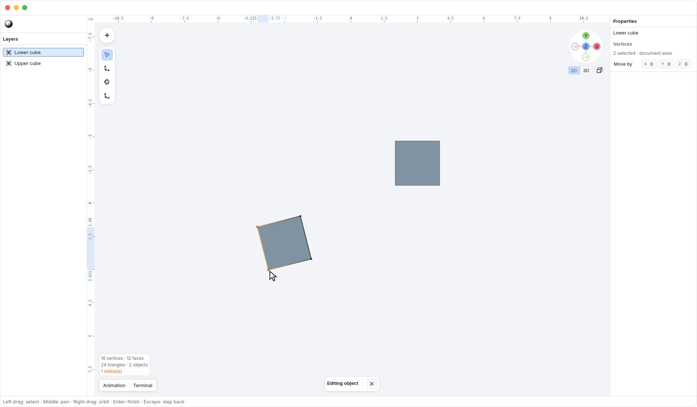

<!-- Generated by `just docs update`; edit docs/templates/*.md.in and src/documentation/scenarios/*.rs. -->

# 2D ruler

The slim <code>Horizontal 2D ruler</code> above <code>Viewport</code> and the
<code>Vertical 2D ruler</code> on its left appear in **2D mode** in settled Front,
Back, Right, Left, Top and Bottom orthographic views. They stay hidden in 3D,
perspective and free oblique views. When changing between 2D axes, the ruler
and floating controls stay in place throughout the animation. Ruler zero and
selection highlights follow the moving scene. Entering from perspective shows
the ruler once the camera reaches orthographic projection. Use the
[gizmo's 2D/3D tabs](gizmo.md) to choose navigation mode.

The 2D ruler starts visible each time you enter 2D. Press
<kbd>Shift</kbd> + <kbd>R</kbd> to hide or show it without changing the document.
Objects stay at exactly the same screen position and size when it toggles.
Floating tools and the axis gizmo move inward to leave room for the visible strips.
Right-click either strip and choose <code>Horizontal 2D ruler → Hide 2D ruler</code> to hide it, or use
<code>N3 → View → 2D ruler</code> to show it again. These controls are
available only in 2D mode.

Changing axes through the gizmo, View menu or number keys uses the same behavior.
Requesting the current named view again does nothing; repeating a pending
destination does not restart its animation. Clicking the facing gizmo axis
still switches to the opposite side.

The rulers are 20 points thick. Muted, centered labels sit beside short major
marks, and a thin edge separates each strip and the unit corner from the scene.
Numbered marks can use intermediate steps to keep their density even as you zoom.
Ticks use the [display unit chosen in Preferences](length-units.md): centimeters
by default, with millimeters, meters, inches and feet also available.
Numbers increase rightward along the top and downward along the left. Each
zero marks the projected document origin. Panning moves that origin; zooming
changes the spacing while keeping measurements in the selected unit. Changing
display units relabels the ruler without resizing geometry or moving its spans.

Two-finger scrolling pans in 2D, and pinching zooms. Hold <kbd>Option</kbd> and
left-drag to [orbit into 3D](orbit-tool.md) and hide the 2D ruler. <kbd>Shift</kbd> with
scrolling continues to pan. Middle-button dragging also pans, and right-button
dragging orbits into 3D.
Apply or cancel a pending [Move session](axis-locks.md) before navigating.

Select objects to highlight their projected width and height. Separate objects
keep separate ranges wherever there is a gap; the 2D ruler does not fill the space
between them. Highlighted ranges use a soft blue fill without an outline;
the blue endpoint values sit outside each range.
Nearby regular numbers fade when they compete with an endpoint value.

Press <kbd>Enter</kbd> with a mesh selected. In vertex mode, the highlights cover
the combined bounds of the selected vertices. Unselected vertices do not extend the highlighted range.
With nothing selected, the ticks remain and the highlights disappear.

The 2D ruler is read-only. Its strips overlay the top and left edges of the scene
and do not change geometry or selection when clicked.

See [2D](2d.md), [number keys and fitting the view](view-keys.md) or
[editing geometry](editing.md). [Back to guide](README.md).
