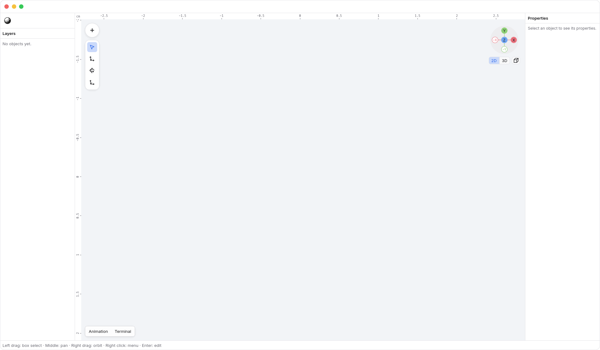
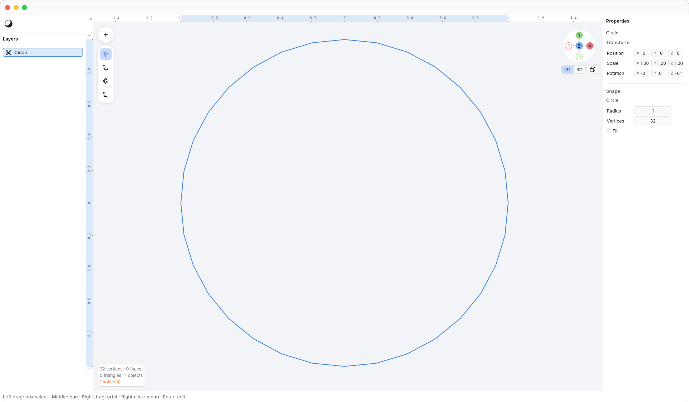
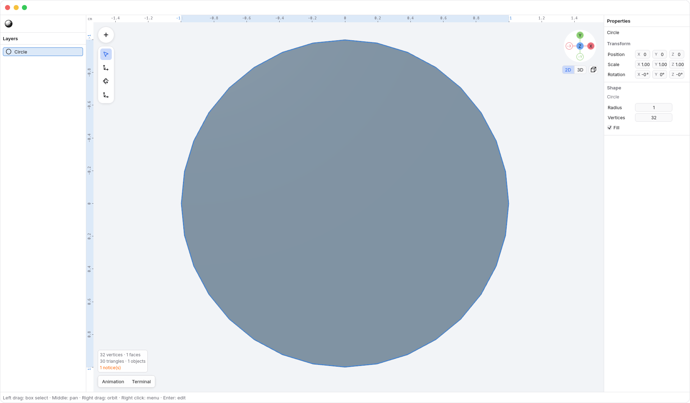

<!-- Generated by `just docs update`; edit docs/templates/*.md.in and src/documentation/scenarios/*.rs. -->

# 2D

Choose <code>Axis gizmo → 2D</code> to work in an aligned orthographic view. 2D
keeps the same objects and modeling tools, but navigation is screen-aligned:
two-finger scrolling pans, pinching zooms, and the camera stays aligned until
you orbit or return to 3D. The 2D ruler appears by default along the top and
left of the viewport. The grid remains a visual reference.

An empty 2D viewport stays clear for drawing. The centered 3D Insert prompt
does not appear; the floating Insert button remains available.

## Plane and Circle

Insert a Plane for a rectangle, or choose <code>Insert → Circle</code> for a
closed loop. Both face the current 2D view and keep you in 2D.
Plane has separate Width and Height controls. Circle starts with a radius of
1 cm, 32 vertices, and no fill. Click its outline to select it; its empty
center does not select the object.

Change <code>Properties → Radius</code> or <code>Properties → Vertices</code>
in Properties to resize the circle or adjust its number of segments.

Turn on <code>Properties → Fill</code> to make a filled polygon, or turn it
off to return to an outline. Both are the same Circle primitive, and Undo
restores each parameter change in one step.

Entering vertex edit mode keeps the Circle's parameters. Only an effective
vertex edit converts it into an editable mesh; see
[making and editing a model](editing.md) for that workflow.

## Navigation and measurement

Use the [2D ruler](2d-ruler.md) to read document units and selected-object
bounds, or hide it temporarily with <kbd>Shift</kbd> + <kbd>R</kbd>. See
[navigation](navigation.md) for gestures, [axis gizmo](gizmo.md) for switching
views, and [moving along axes](axis-locks.md) for precise edits.

[Back to guide](README.md).
