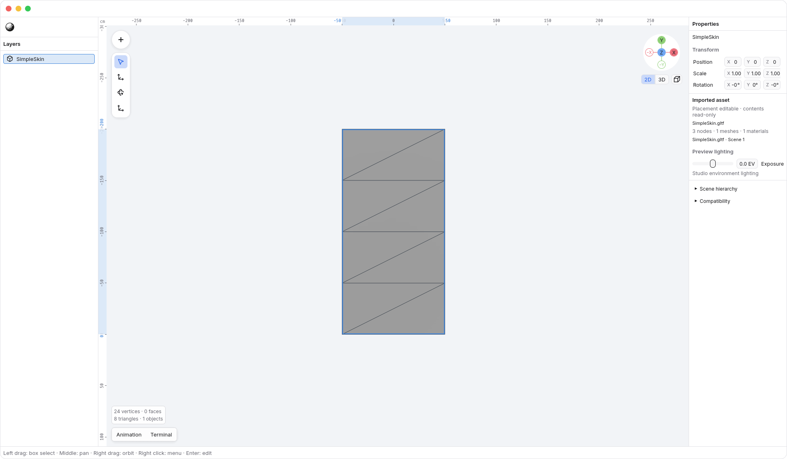
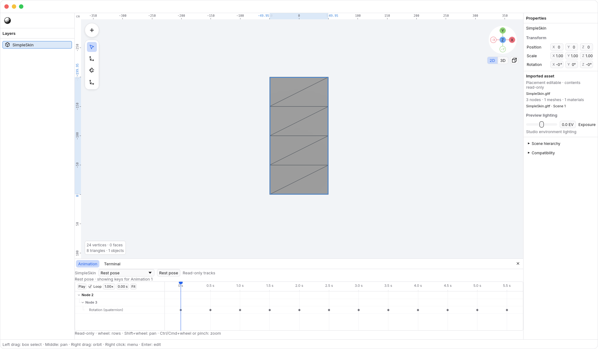
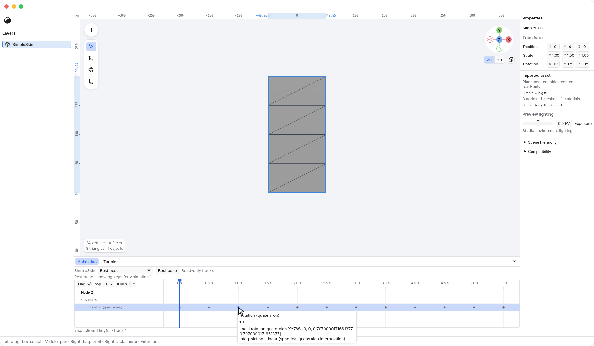
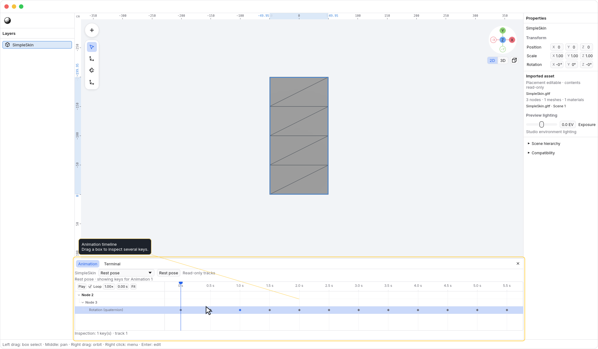
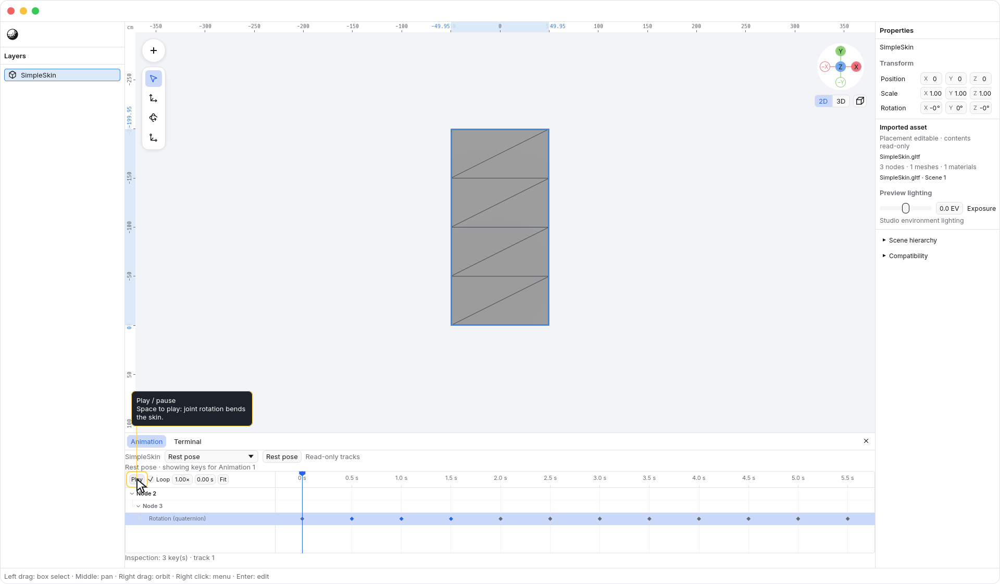
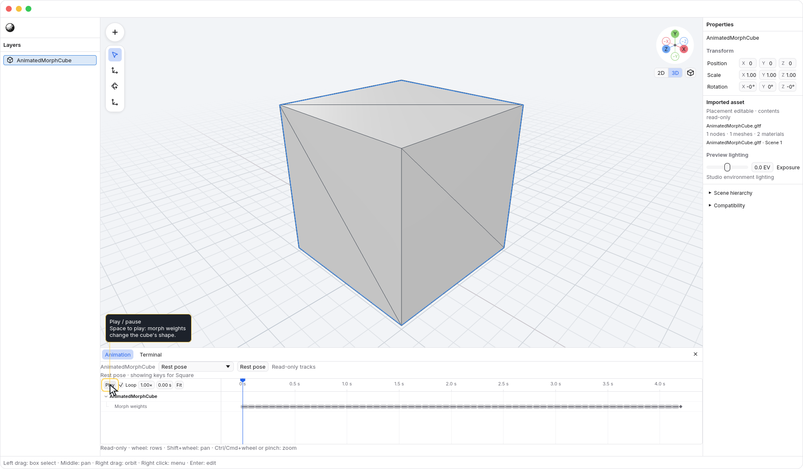

<!-- Generated by `just docs update`; edit docs/templates/*.md.in and src/documentation/scenarios/*.rs. -->

# Inspecting animation

Choose <code>Tool Dock tab bar → Animation</code> in the Tool Dock tab bar at the viewport's
lower-left, below the scene statistics, to open Animation in the Tool Dock.
It stays closed until you ask for it, including when importing an animated asset.
Select an imported asset to inspect its clips in the same viewport as the rest
of the editor. Imported animation is read-only: you can inspect and play it,
but cannot move keys or author new tracks.

When open, the Tool Dock tab bar moves into a compact panel header. Animation stays selected;
clicking its selected tab focuses the timeline without closing the Tool Dock or
changing playback.

The open panel follows the active object selection. With no imported asset
selected, it shows an empty state. Use <code>Tool Dock tab bar → Close Tool Dock</code> to close the
Tool Dock; its tab bar returns to the viewport. Closing idle Animation preserves the accepted
preview, including playback.

## Read a clip

Choose a clip with <code>Animation timeline → Animation</code>. The timeline groups its keys by
source node and animated property. It shows the selected clip's channels across
the source asset, including channels that may not affect its currently placed
source scene.

When the selector says Rest pose, the viewport shows the original pose. The
first clip's tracks are still available to inspect; displaying those tracks does
not start or apply that clip.

Click a key to select it for inspection; hover it to read its time and values.
This does not move the playhead or change the pose. This example has a Rotation
track on a joint:

Times are seconds from the clip's start. Keys keep their original timing rather
than being rounded to a frame grid. <code>Animation timeline → Fit</code> fits the clip's
time range into the panel.

## Box-select keys

Drag from empty space in the key area to draw a selection box. Keys whose
markers intersect the box are selected when you release, including keys on
different visible tracks. A dense cluster selects all the keys it represents.
Hold <kbd>Shift</kbd> when starting the box to add to the current selection.
While still dragging, <kbd>Escape</kbd> cancels the box and keeps the previous
selection.

Box selection only changes which keys you inspect; it does not move the playhead
or change animation values. An empty-space click without dragging seeks to that
time on release. The ruler and playhead remain available for scrubbing.

## Play and scrub

Use <code>Animation timeline → Play / pause</code> to start or pause, or press
<kbd>Space</kbd> while the timeline has focus. Opening the panel
focuses its timeline; clicking the timeline focuses it again after using the
viewport. Text fields keep their normal typing behavior. Viewport shortcuts
resume when you focus the viewport.

Playing from Rest pose starts the first clip. Drag <code>Animation timeline → Time ruler</code> to inspect a different moment, or
enter a time in <code>Animation timeline → Time</code>. Scrubbing pauses playback; releasing the
pointer keeps the inspected pose paused.

While a scrub is still held, <kbd>Escape</kbd> cancels it and restores the
pose and playback state from before the drag. Returning to
<code>Animation timeline → Rest pose</code> stops playback and restores the original rest pose.

Here, joint rotation bends a skinned mesh. The viewport responds while the
playhead moves, and cancelling a second scrub restores the previous pose:

<code>Animation timeline → Loop</code> controls repetition, and <code>Animation timeline → Speed</code> changes
the playback multiplier. These preview controls do not change the source clip.

## Inspect shape changes

A morph-weight track changes a mesh's shape instead of its object placement.
This clip blends two morph targets; its keys show the weight values together:

Playback, scrubbing, key inspection, and timeline navigation do not modify the
document or add undo steps. Placements of the same source scene currently share
playback. The timeline is a preview of that source clip, not an authored
animation for the N3 document.

See [imported assets](scene-viewer.md) for placement, materials, and linked files.

[Back to guide](README.md).
