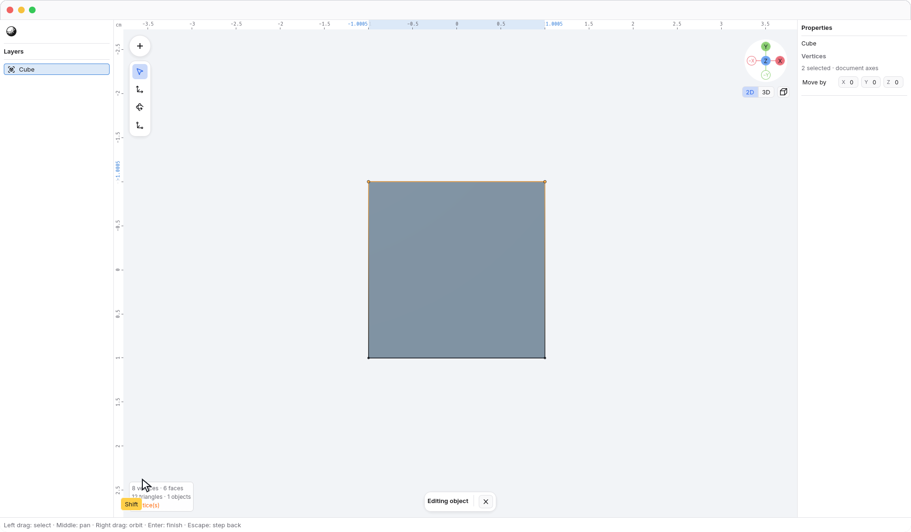
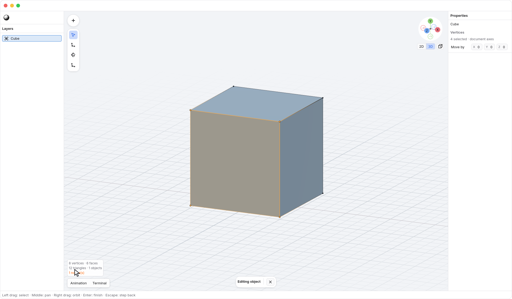

<!-- Generated by `just docs update`; edit docs/templates/*.md.in and src/documentation/scenarios/*.rs. -->

# Reading vertex selections

Select a mesh and press <kbd>Enter</kbd> to edit its
vertices. Use <code>Tools → Cursor</code> when you want to inspect and select without
transform handles in the way.

Small vertex markers keep dense meshes readable. Selected vertices appear **warm orange**;
unselected vertices appear **dark**. The click target remains larger than the marker.
Edges describe the same vertex selection:

- Both endpoints selected: the whole edge is orange.
- One endpoint selected: the edge fades from orange at that endpoint to dark at
  the other.
- Neither endpoint selected: the edge stays dark.

Click a visible vertex to select it. <kbd>Shift</kbd>-click adds or removes a vertex.
Here, two adjacent vertices are selected. Their shared edge is solid orange;
neighboring edges fade toward their unselected endpoints.

A polygon receives a subtle orange fill only when **all of its vertices** are
selected. Selecting three corners of a four-corner face does not tint that
face, even though it is internally rendered as triangles. The visible edges
follow the original polygon boundaries; no triangulation diagonal is introduced.
Here the same cube is viewed from an angle: the selected front face is tinted,
and its depth edges fade toward unselected rear vertices.

This is feedback for the existing vertex selection, not a separate edge or face
selection mode. Nothing about the mesh, undo history, or how clicks and drags
select vertices changes. While editing, the active mesh's boundary edges remain
visible even if the general object-edge display is off.

With [X-ray](xray.md) off, the colors respect depth. Hidden vertices and edges
do not become visible through the mesh or other objects, and partially hidden
faces only tint their visible surface. Enable X-ray to reveal and select rear
vertices and edges. Turning it off keeps those vertices selected. Click the X
(<code>Editing object → Exit edit mode</code>) in the <code>Editing object</code> bar or press
<kbd>Enter</kbd> again when idle to leave vertex editing.

See [editing geometry](editing.md), [selecting with keys](selection-keys.md), or
[numeric transforms](numeric-transforms.md). [Back to guide](README.md).
