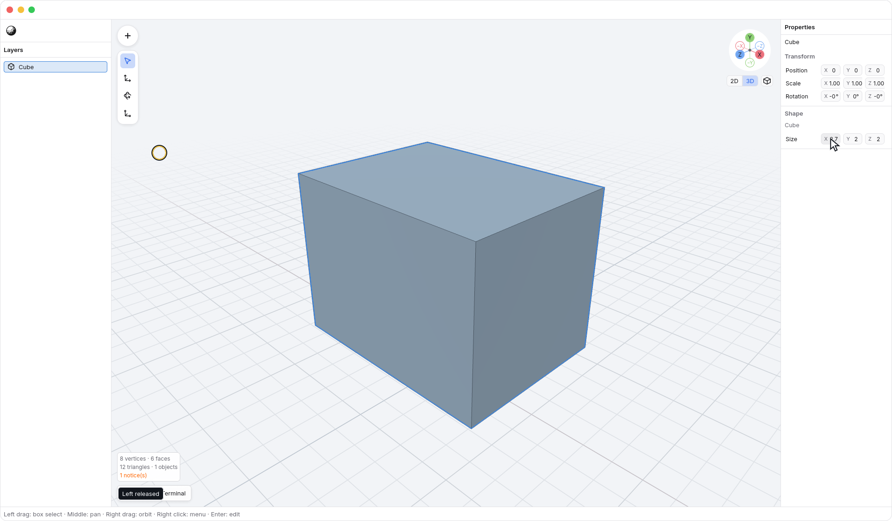
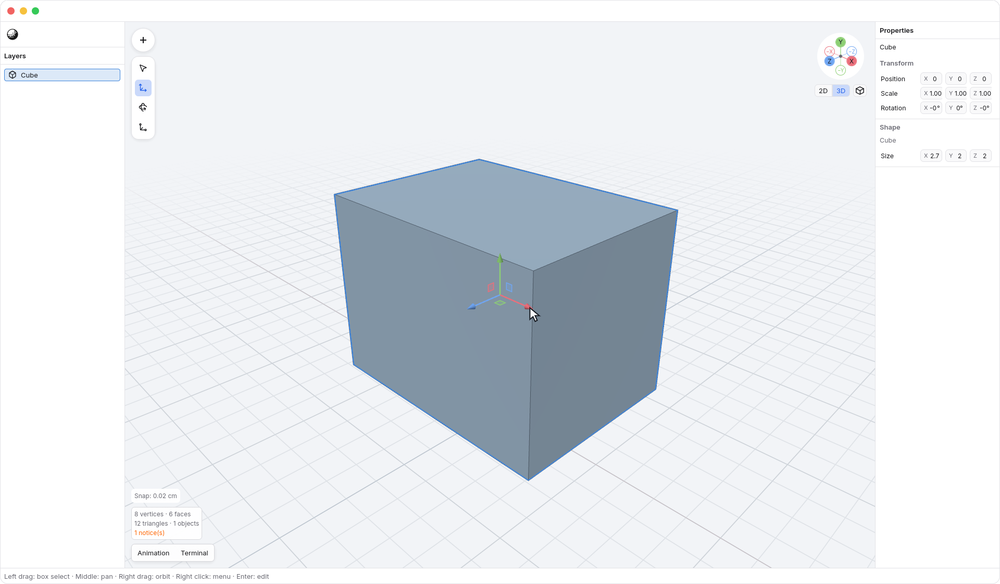
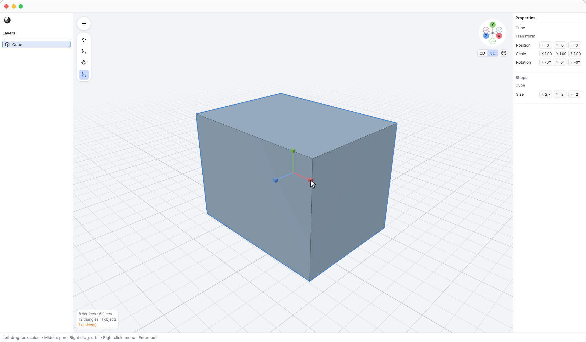
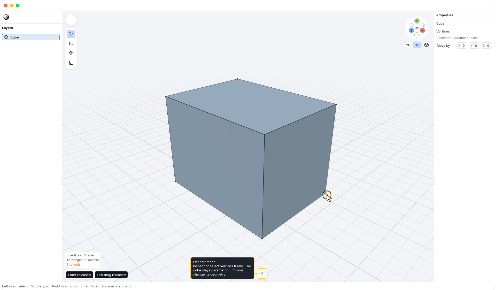
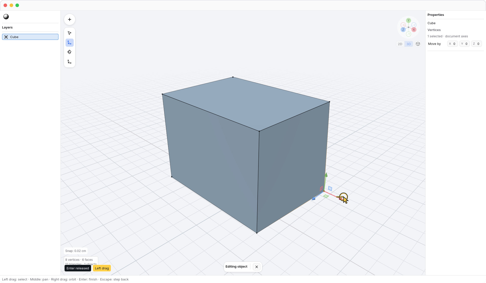
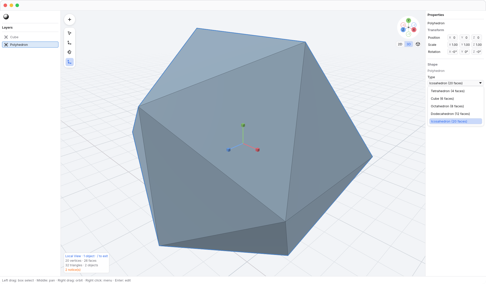
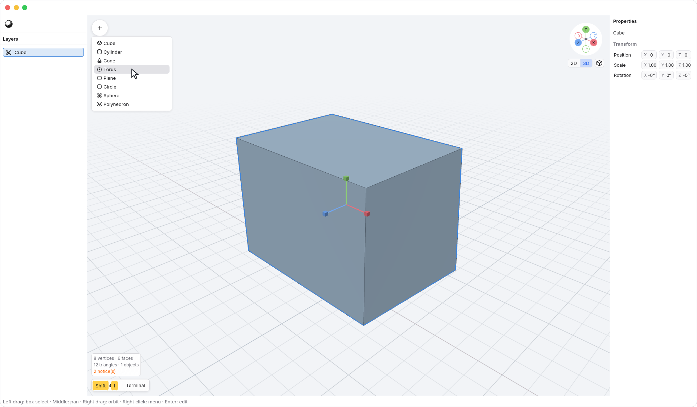
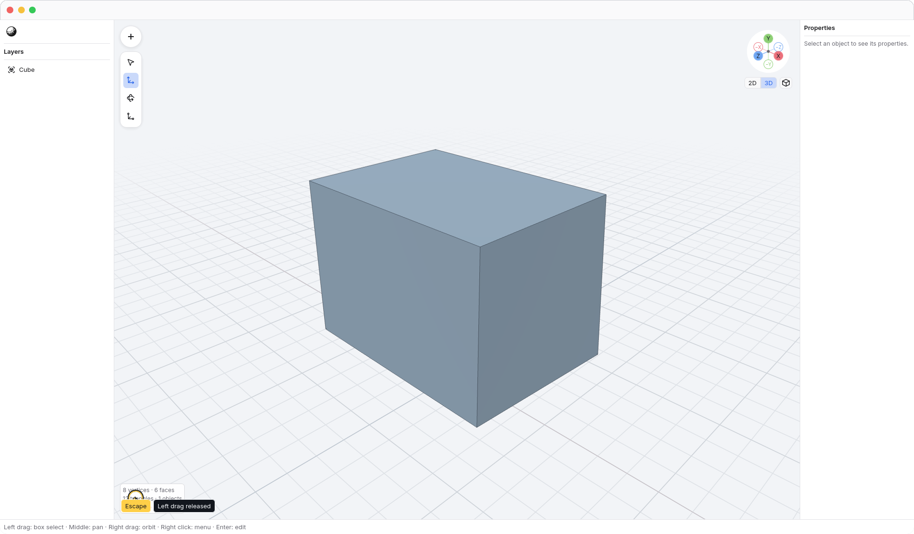

<!-- Generated by `just docs update`; edit docs/templates/*.md.in and src/documentation/scenarios/*.rs. -->

# Making and editing a model

Open <code>N3</code> → <code>N3 → File</code> and choose <code>N3 → File → New</code> to start an empty document, then open
the viewport's <code>Insert</code> button or press <kbd>Shift</kbd> + <kbd>I</kbd> and choose
<code>Insert → Cube</code>. The new object is selected.
Use <code>Layers</code> on the left to select an object. Its geometry parameters
and transforms appear in <code>Properties</code> on the right.

1. Drag or type into <code>Properties → Width</code>. The cube updates as the value changes;
   the completed gesture becomes one Undo step.
   The cube remains a primitive: you can change its dimensions again later.
   Saving and reopening the document preserves these parameters.

Move handles have solid cone tips pointing along each axis. The colored shafts
meet at the selection's pivot without gaps or outlines. Drag a tip or its shaft
to move along that axis. A small invisible margin around each tip makes it easier
to grab without precise aiming.

Scale handles use solid cubes. Drag a cube or its shaft to scale along that axis;
with several objects selected, the single cube scales them uniformly.
The cubes have the same forgiving margin as Move tips.
The handles stay readable over the model as you orbit or zoom. Releasing a
regular handle drag completes one Undo step.

N3 stores lengths in centimeters. <code>Preferences → Display unit</code> in Preferences changes
how bare-number length fields are interpreted and how the 2D ruler is labeled without
resizing geometry. You can type a unit suffix such as `mm` or `in` to override
the display choice; see [length units](length-units.md).

2. Press <kbd>Enter</kbd> or double-click the object to edit individual
   vertices. You can inspect and select its vertices
   without changing the primitive. Leave without modifying geometry and its Shape
   parameters remain available.

The first effective vertex change automatically turns the primitive into an
editable mesh, in the same undo step as your edit. Undo that change and the
original primitive returns, even while you remain in vertex edit mode. Leave
after undoing all vertex changes and its Shape parameters are still there.
If you keep the changes, the object remains a mesh and no longer shows primitive
parameters in Properties. Returning the vertices exactly to their starting
positions and topology during this edit visit also retains the original
primitive; N3 does not guess a primitive from an approximately matching shape.

Drag a small selection box around visible vertices, or enable [X-ray](xray.md)
to include vertices behind surfaces. The current selection stays
unchanged while you drag and updates when you release. With
<code>Tools → Move</code> selected, drag the <code>X</code> handle to move
the selection along that document axis. [Movement snapping](snapping.md) is
enabled by default; it moves the selected vertices together. The other vertices
stay in place. Selected vertices are warm orange, and their connected edges
fade toward any unselected dark endpoints. A complete polygon selection adds
a subtle orange face tint. See [reading vertex selections](edit-selection.md).

To add a surface, use [Make Face](make-face.md) on three vertices or one complete
flat outline. This creates a polygon through the same edit and Undo workflow.

Press <kbd>Enter</kbd> during a handle drag or selection box to finish
the gesture at its current position. The next idle press returns to object mode.
An [axis-locked Move](axis-locks.md) keeps its preview across drag and key
releases: <kbd>Enter</kbd> or a viewport double-click applies the complete session;
<kbd>Escape</kbd> cancels it.
For an [exact transform](numeric-transforms.md), choose Move, Rotate, or Scale,
lock an axis with <kbd>X</kbd>, <kbd>Y</kbd>,
or <kbd>Z</kbd>, and type the amount. <kbd>Enter</kbd> applies the session;
<kbd>Escape</kbd> cancels it.

Press <kbd>Command</kbd> + <kbd>Z</kbd> to undo the move, or <kbd>Shift</kbd> + <kbd>Command</kbd> + <kbd>Z</kbd> to
restore it. Click the X in the **Editing object** bar (<code>Editing object → Exit edit mode</code>) or
press <kbd>Shift</kbd> + <kbd>Enter</kbd> to return directly to object mode.

With an object selected, <kbd>Enter</kbd> switches between object and vertex
edit modes, keeping the same object and tool. Double-click the object to enter
vertex editing; double-click empty viewport space to leave it while keeping the
object selected. Double-clicking an object surface away from vertices stays in edit
mode. These mode changes do not change the document or add undo steps.
With no object selected, <kbd>Enter</kbd> does nothing.

The floating toolbar shows <code>Tools → Cursor</code>, <code>Tools → Move</code>,
<code>Tools → Rotate</code>, and <code>Tools → Scale</code> icons from left to right.
While editing vertices, a separate <code>Editing object</code> bar appears
at the viewport's bottom center; it contains the X for leaving edit mode.
Hover an icon for its name and shortcut. <kbd>Q</kbd> also selects the cursor tool;
it hides transform handles without changing geometry or selection.
With no axis lock or pending Move session, left-drag selects with every tool.
Middle-drag pans and right-drag orbits in either editing mode after you apply or
cancel any pending Move preview.

3. Open <code>N3</code> → <code>N3 → File</code> and choose <code>N3 → File → Save</code> to save an N3 document. Use
   <code>N3 → File → Save as…</code> to choose another file. The native document
   preserves primitive parameters, editable vertices, polygon faces, loose edges, and object
   transforms; OBJ is an import format.

The Insert menu offers parametric primitives. Alongside the cube,
<code>Insert → Plane</code>, <code>Insert → Circle</code>, <code>Insert → Cylinder</code>, <code>Insert → Cone</code>,
<code>Insert → Torus</code>, <code>Insert → Sphere</code>, and <code>Insert → Polyhedron</code> remain parametric: their
size and relevant segment counts stay editable. Plane is one flat, four-corner
surface with Width and Height. Circle has Radius, Vertices, and an optional Fill
that starts off. Both face the current view when inserted in [2D](2d.md).
Sphere uses latitude rings and
longitude segments, with no texture coordinates yet.

Polyhedron starts as an icosahedron. In Properties,
<code>Properties → Polyhedron type</code> offers all five convex regular solids.
Each preset includes its face count, so you can choose without knowing the names:

- <code>Properties → Polyhedron type → Tetrahedron (4 faces)</code>
- <code>Properties → Polyhedron type → Cube (6 faces)</code>
- <code>Properties → Polyhedron type → Octahedron (8 faces)</code>
- <code>Properties → Polyhedron type → Dodecahedron (12 faces)</code>
- <code>Properties → Polyhedron type → Icosahedron (20 faces)</code>

Choosing a preset changes the topology of the same parametric object.
Polyhedron has one uniform size control so its edges stay regular; use object
Scale to stretch it. Undo restores the previous type before removing the
inserted object. An effective vertex edit converts the primitive to an editable
mesh. Existing icons provide a visual cue until dedicated shape icons are available.

Opening the menu changes no geometry. Choose a shape to insert it, or press
<kbd>Escape</kbd> to close the menu and keep your selection. You can release the shortcut
keys before choosing a shape.

<kbd>Escape</kbd> backs out one step at a time. A popup, text field, or
modal handles it first; with no focused field, it closes <code>N3 → Preferences</code>.
Otherwise it cancels an active transform or selection box. For a pending
[Move session](axis-locks.md), it restores the entire starting state and clears
the axis in one press. Further presses clear selected
vertices, then leaves vertex edit mode while keeping the object selected, and
finally deselects the object. Pressing it again with nothing selected does nothing.
Clearing selection hides object fields and transform handles. The display-unit
preference remains available in Preferences;
it does not change the document or its saved state.

See [moving along axes](axis-locks.md), [opening models](opening-models.md), [navigation](navigation.md), or the
[axis gizmo](gizmo.md). [Back to guide](README.md).
