<!-- Generated by `just docs update`; edit docs/templates/*.md.in and src/documentation/scenarios/*.rs. -->

# Axis gizmo

The <code>Axis gizmo</code> in the viewport's top-right corner shows your viewing direction. X is red, Y is green, and Z is blue. Filled handles mark positive axes; outlined handles mark negative axes.

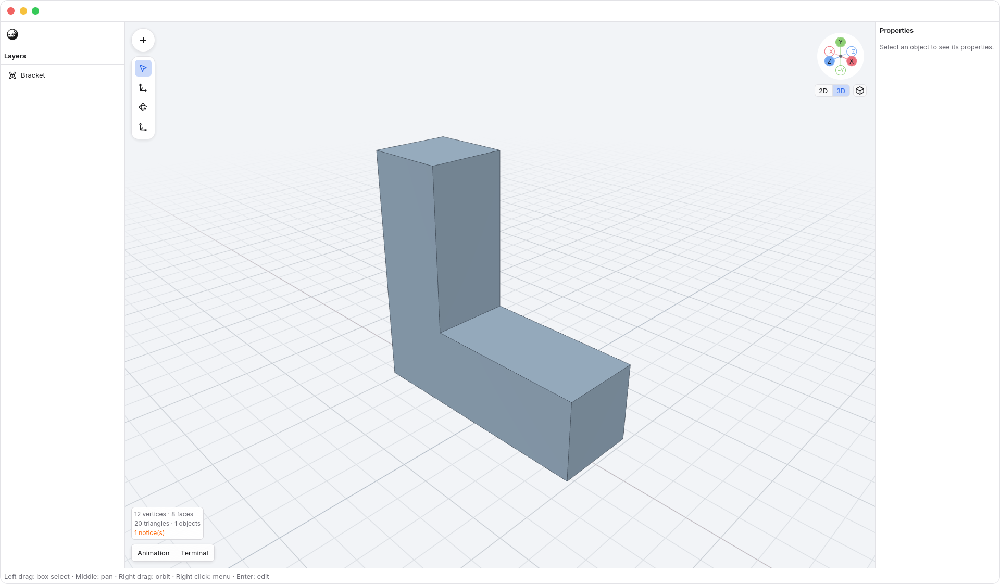

The <code>Axis gizmo → 2D</code> and <code>Axis gizmo → 3D</code> tabs choose navigation
mode. **2D (Planar)** snaps to whichever of Front, Back, Right, Left, Top or Bottom
is closest to your current viewing direction, preserving pan and zoom. It uses
orthographic projection and the 2D ruler. On entering 2D, N3 remembers your visible
3D orientation. Changing axes while in 2D keeps that remembered orientation.
By default, **3D (Free)** returns to it in perspective, keeping any pan and zoom
you made in 2D and hiding the 2D ruler.

Tap <kbd>.</kbd> to switch between the same two navigation modes. Orbit to the angle
you want, then tap <kbd>.</kbd> to align with its nearest axis; tap it again to return
to 3D using your Gizmo preferences. The action runs when you release the key.
Typing decimal values in a focused field keeps its normal behavior. With an
active transform axis, <kbd>Period</kbd> enters a decimal point in the
[numeric transform amount](numeric-transforms.md); finish or cancel that session
before using the navigation shortcut.

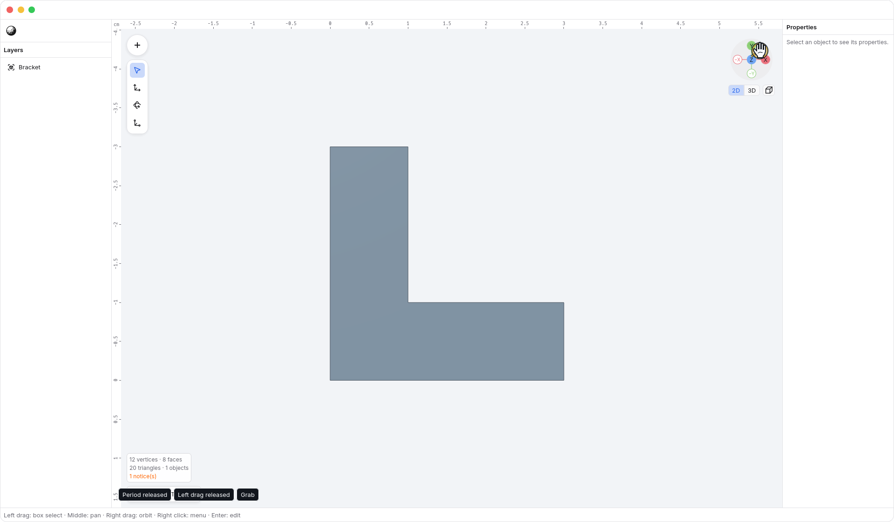

Two-finger trackpad twists leave 2D unchanged, including during alignment. To
orbit out, use [<kbd>Option</kbd> + left-drag](orbit-tool.md), right-button drag, or
drag the gizmo. <kbd>Shift</kbd> with two-finger scrolling always pans. Manual orbit
continues from the visible axis angle without recalling the earlier view;
choosing 3D performs the configured return instead. The explicit Perspective
preset still uses its default viewing angle.

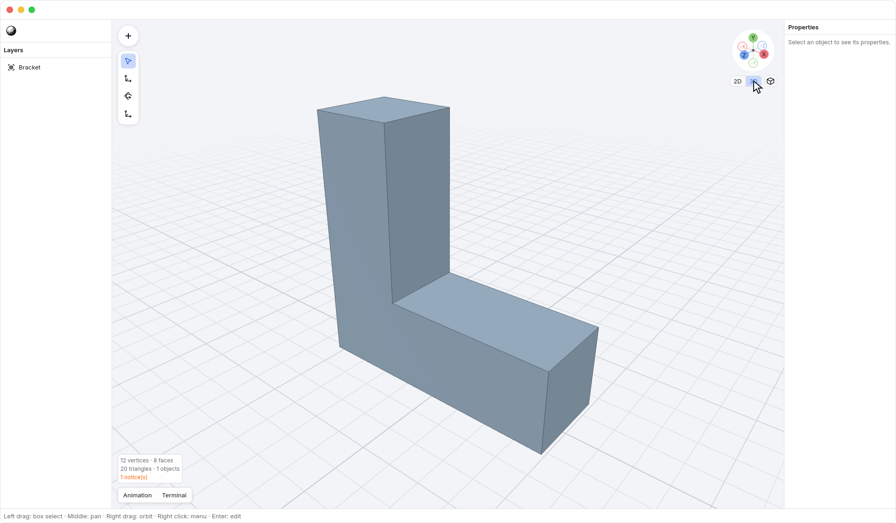

1. Move the pointer over <code>Axis gizmo → X</code>. The handle highlights and the pointer becomes a hand.

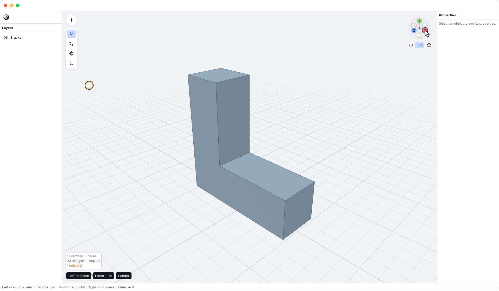

2. Hold the primary mouse button and drag the handle to orbit. You can continue dragging outside the gizmo; the grabbing pointer follows you.

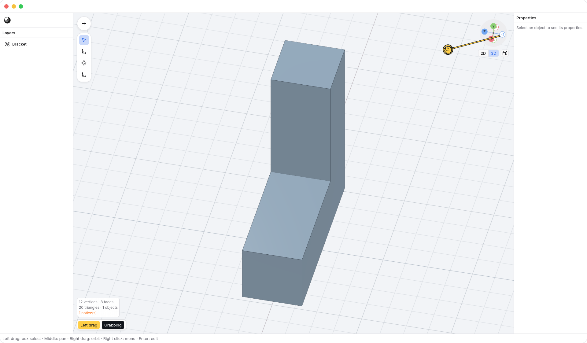

Watch a drag orbit freely, then an axis click animate into alignment.

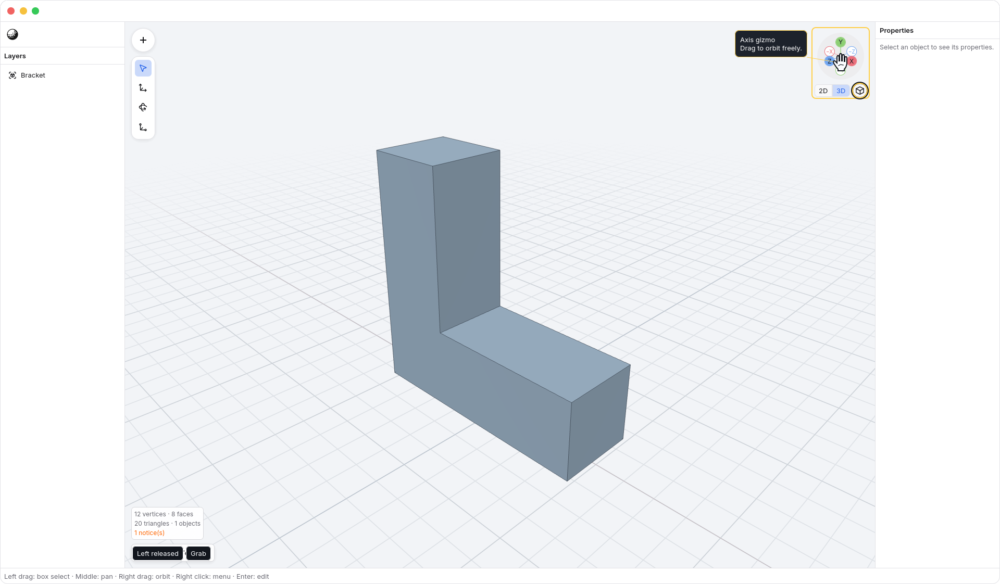

3. Release at the angle you want. Releasing a drag leaves that angle in place. You can also drag the gizmo body.

Click <code>Axis gizmo → X</code>, <code>Axis gizmo → Y</code>, or <code>Axis gizmo → Z</code> to look straight along that axis and enter 2D. The corresponding negative handles show the opposite sides. Clicking the facing handle again flips to the opposite side. Orbiting switches to 3D; choose 2D to snap to the nearest axis from your new angle.

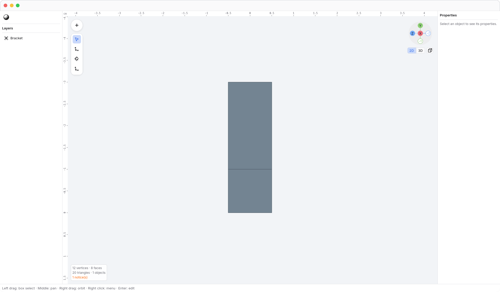

## Projection

The <code>Axis gizmo → Projection</code> cube button sits beside the 2D/3D tabs below the axis
disk. Its icon shows the **current projection**; click it to switch to the other
projection without changing the viewing angle, pan, zoom, geometry, or selection.

A cube with three visible faces means **perspective**. Click it for orthographic
projection.

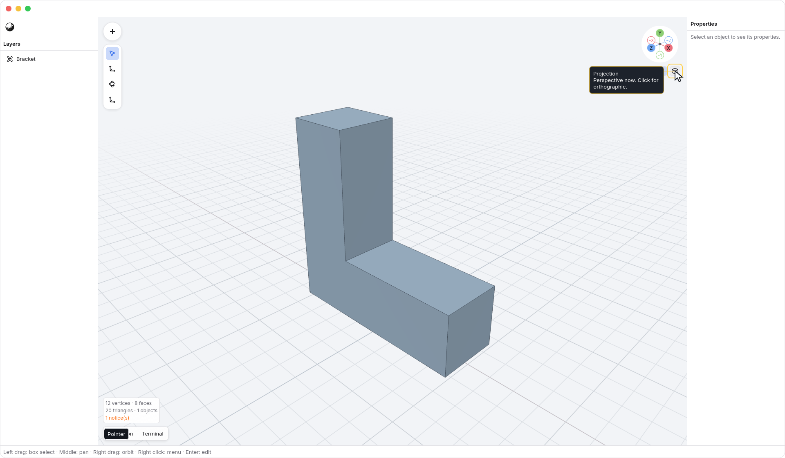

A front-facing square with an offset outline means **orthographic**. Click it
for perspective projection.

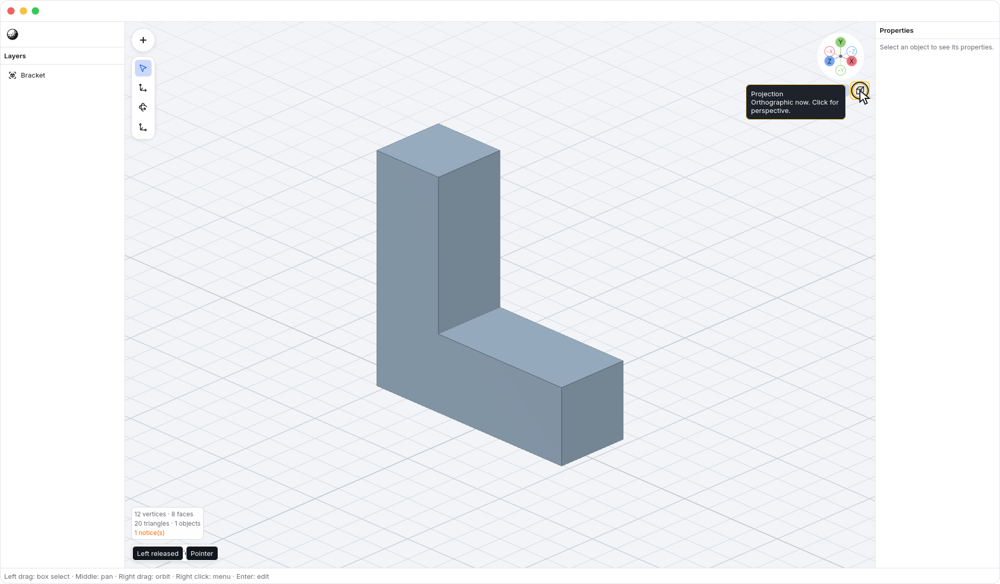

Projection and navigation mode are separate: switching to orthographic while
in 3D keeps free orbiting. Switching to perspective leaves 2D and hides the 2D ruler.
The 2D tab still aligns to the nearest axis and chooses orthographic projection.

## Animation

Axis clicks and returning to 3D animate over **120 ms** by default. Taking hold of the gizmo interrupts the transition at the visible angle.

Panning or zooming during a pending 2D alignment first completes the alignment,
then applies your movement. Orbiting starts from the currently visible angle
and switches to 3D.

Right-click <code>Axis gizmo</code>, then choose <code>Axis gizmo → Gizmo preferences…</code> to open the settings. Opening this menu leaves an in-progress view transition running.

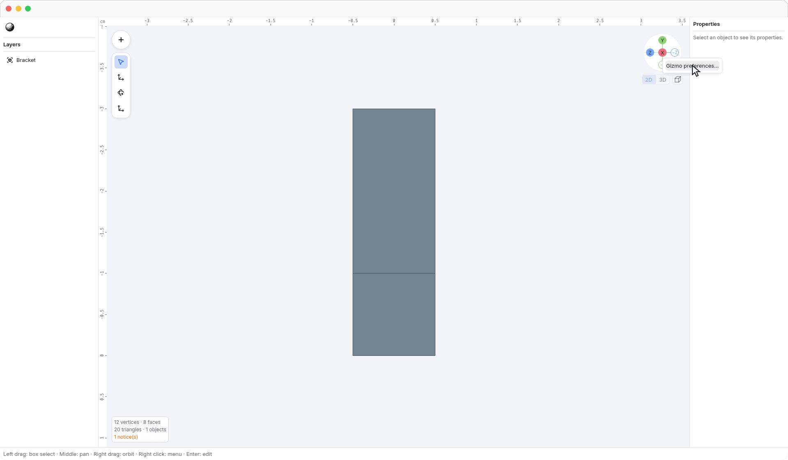

Under Gizmo, <code>Preferences → Return to 3D</code> chooses what the 3D tab restores:

| Setting                                 | Result                                                                      |
| --------------------------------------- | --------------------------------------------------------------------------- |
| <code>Preferences → Return to 3D → Perspective only</code> | Keep the current orientation and switch to perspective.                     |
| <code>Preferences → Return to 3D → Previous orientation</code> | Restore the previous 3D orientation and keep the current projection.        |
| <code>Preferences → Return to 3D → Previous orientation + perspective</code>        | Restore the previous 3D orientation and switch to perspective; the default. |

All three keep your current pan and zoom. The preference is saved globally.

Use <code>Preferences → Animate view changes</code> to turn transitions on or off. Adjust <code>Preferences → Duration</code> between **0–1000 ms**; it applies to the next view change, including a return to 3D. Zero makes the change immediate. Turning animation off finishes any current transition and makes subsequent view changes immediate.

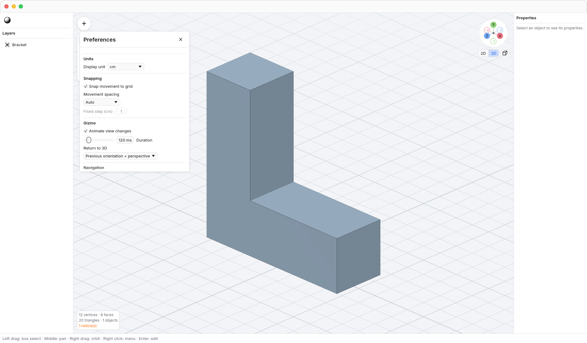

You can also open the same window with <code>N3 → Preferences</code> under the N3 menu.
These [global user preferences](settings.md) persist across app launches and can
also be edited in `settings.json`.

See [navigation](navigation.md) for viewport controls. [Back to guide](README.md).
