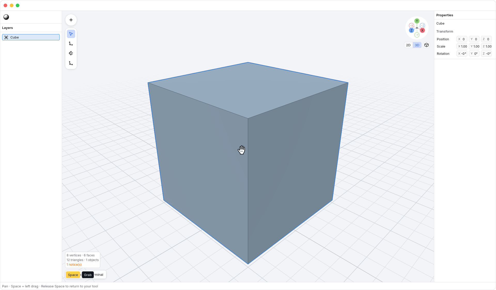
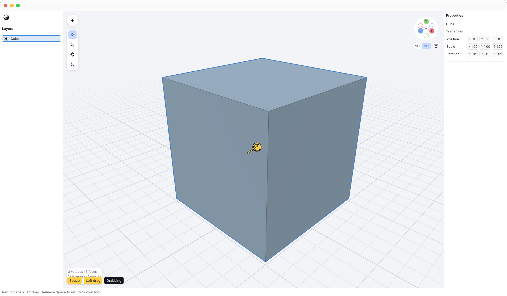
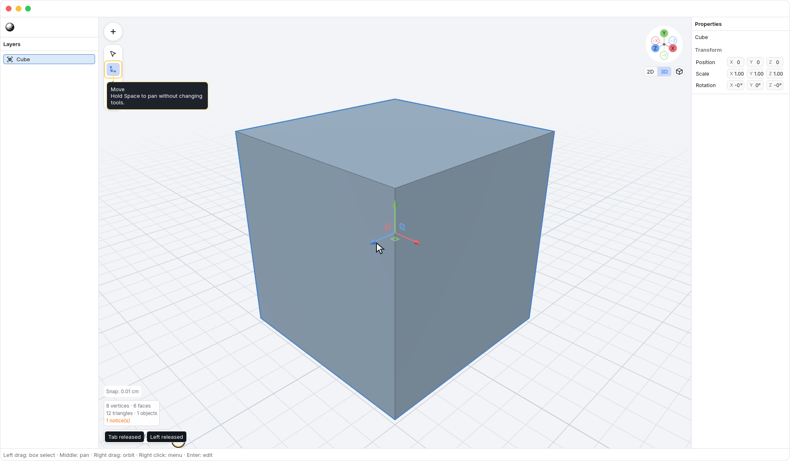

<!-- Generated by `just docs update`; edit docs/templates/*.md.in and src/documentation/scenarios/*.rs. -->

# Panning with the hand tool

Move the pointer over <code>Viewport</code> and hold <kbd>Space</kbd>.
The open-hand cursor shows that you can pan without changing your selected
tool. This works in object and vertex edit modes with View, Move, Rotate,
or Scale selected.

Keep <kbd>Space</kbd> held and click-drag with the left mouse button or
trackpad. The hand closes while you drag, and the view moves without rotating
or zooming. Your geometry and selection stay unchanged.

This walkthrough shows <kbd>Space</kbd> held during the pan, then released while the pointer keeps moving.

Release <kbd>Space</kbd> to return to your previous tool. Panning stops
immediately, even if the mouse button is still down; its later release does
not select anything.

Press <kbd>Space</kbd> before starting the drag. A selection box or transform already in
progress keeps control if <kbd>Space</kbd> is pressed afterwards. Apply or cancel a
pending [Move session](axis-locks.md) before using the hand tool, even between
drag releases. Text fields and popups
keep their keyboard input, and leaving the application clears the held hand
tool. Two-finger scrolling, pinching, and twisting retain their usual behavior.

Hold <kbd>Option</kbd> instead to [orbit with the left button](orbit-tool.md).
<kbd>Space</kbd> takes precedence if both modifiers are held before a drag. Once a drag
starts, another modifier cannot change its action.

See [navigation](navigation.md) or [editing geometry](editing.md).
[Back to guide](README.md).
