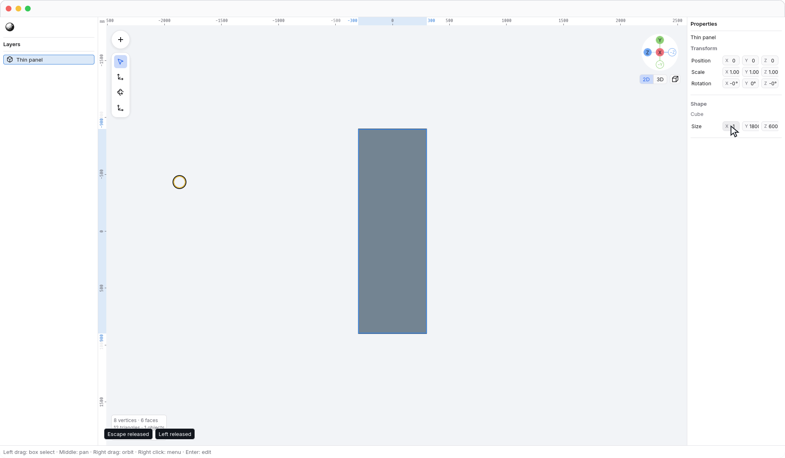
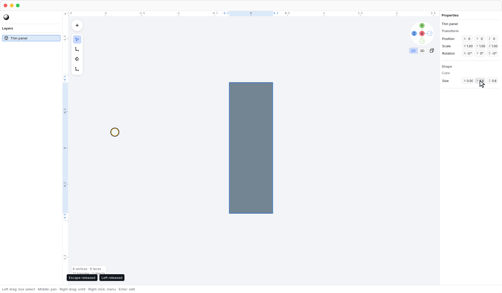

<!-- Generated by `just docs update`; edit docs/templates/*.md.in and src/documentation/scenarios/*.rs. -->

# Length units

**1 N3 unit is 1 centimeter.** Documents always store lengths in centimeters.
Centimeters define the scale, not a minimum size: fractional centimeters remain
valid. Default [movement snapping](snapping.md) chooses clean centimeter
increments suited to the current interaction; it does not restrict movement to
whole centimeters. Precise typed values and existing geometry are preserved.
Changing <code>Preferences → Display unit</code> in Preferences changes how bare-number length
fields are interpreted and how the 2D ruler is labeled; it does not resize the model,
dirty the document, or add undo steps. New documents default to centimeters.

Choose <code>Preferences → Display unit → Millimeters (mm)</code>, <code>Preferences → Display unit → Centimeters (cm)</code>, <code>Preferences → Display unit → Meters (m)</code>,
<code>Preferences → Display unit → Inches (in)</code>, or <code>Preferences → Display unit → Feet (ft)</code>. The display choice is a
[global user preference](settings.md), preserved across New, Open, and app launches.

This panel is **0.1 cm** thick: with millimeters selected, its
<code>Properties → Width</code> shows **1**, meaning **1 mm**.

Its <code>Properties → Height</code> is **180 cm**, shown as **1.8** in meters.
The ruler labels change units while the geometry and highlighted spans stay put.

Type a number to use the selected display unit, or add an explicit `mm`, `cm`,
`m`, `in`, or `ft` suffix to override it. For example, `1 ft` means **30.48 cm**
even while meters are selected; an unsuffixed `1.8` means **180 cm** in meters.
Length input accepts numbers and simple fractions, not arithmetic expressions.
Values preview as you edit; releasing a drag or finishing text input commits one
Undo step. Merely focusing a value or changing the display unit creates none.

Arrow nudges request **1 cm**, or **10 cm** with a coarse nudge such as <kbd>Shift</kbd> + <kbd>Right</kbd>, regardless of the display
unit, zoom, or Auto/Fixed pointer spacing. With snapping enabled, their
destinations align to the one-centimeter keyboard grid; an initially off-grid
position may move a different distance on its first nudge. OBJ numbers are interpreted as
centimeters without automatic rescaling.
Native `.n3.json` files declare `"length_unit": "cm"`; older version-1 files
without the field keep their coordinates and are interpreted as centimeters.

See the [2D ruler](2d-ruler.md), [editing](editing.md), or [moving along axes](axis-locks.md).
[Back to guide](README.md).
