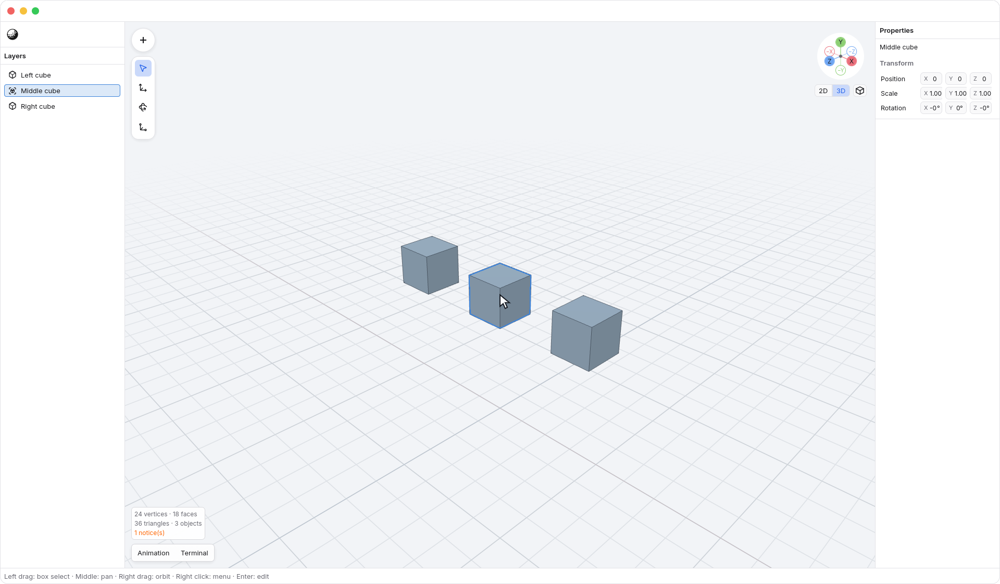
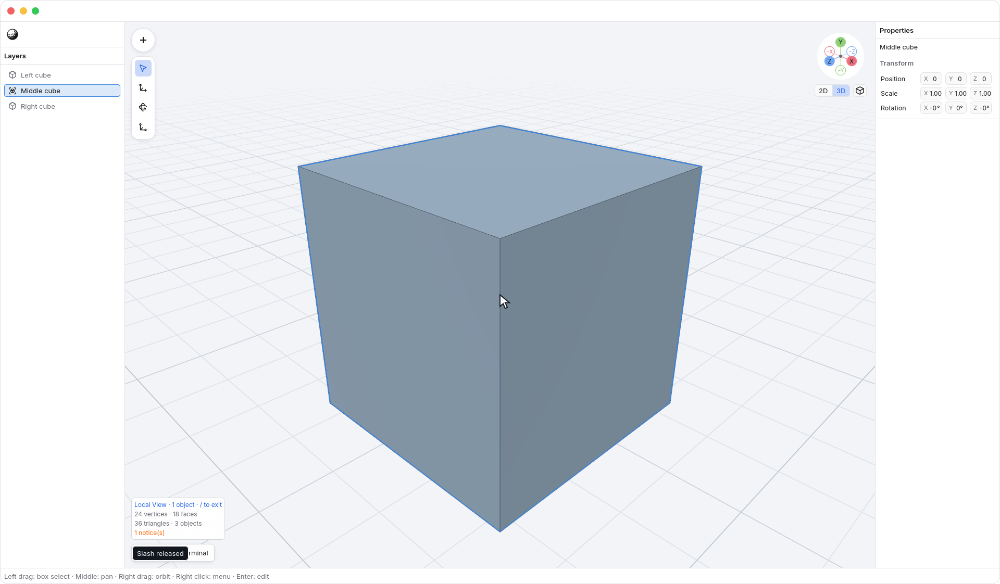
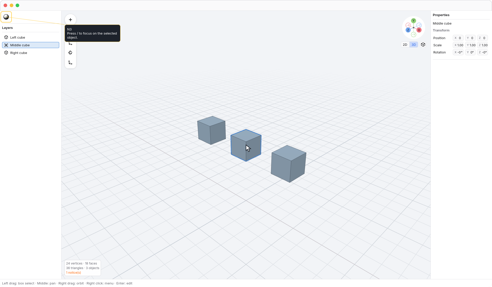
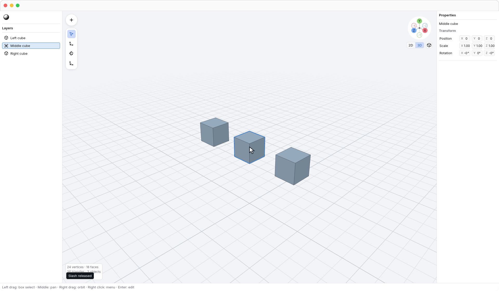

<!-- Generated by `just docs update`; edit docs/templates/*.md.in and src/documentation/scenarios/*.rs. -->

# Local View

Select an object in the <code>Viewport</code>, then press <kbd>/</kbd> to isolate it.
Only the selected object is rendered, and the view fits it so you can work
without the rest of the scene in the way. The objects remain in your document.

Before isolation:

While isolated:

Press <kbd>/</kbd> again to show every object and return to your previous view.
You can also use <code>N3 → View → Local View</code>.
With nothing selected, entering Local View does nothing.

The camera smoothly fits the isolated object and returns to your previous view.
Both transitions use <code>Preferences → Animate view changes</code> and <code>Preferences → Duration</code>,
the same preferences as other view changes. Turn animation off for an instant
transition.

After leaving Local View:

Local View keeps the object selected. Toggling it does not edit geometry or
create an undo step. In vertex edit mode it isolates the entire edited object,
even if no vertices are selected.

See [selecting objects](object-feedback.md) and [fitting the view](view-keys.md).
[Back to guide](README.md).
