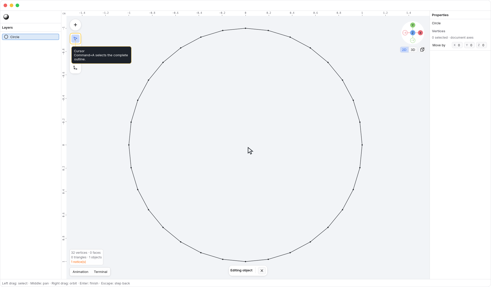
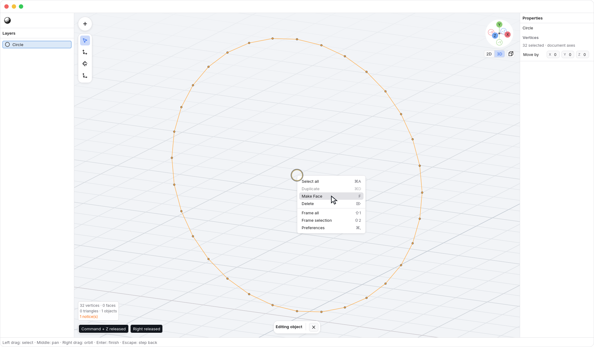
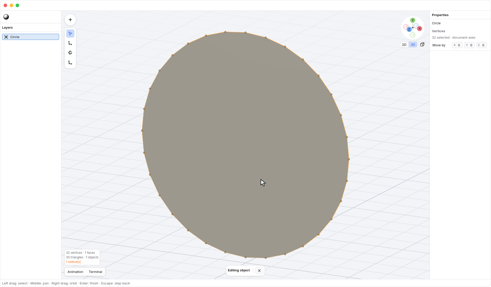

<!-- Generated by `just docs update`; edit docs/templates/*.md.in and src/documentation/scenarios/*.rs. -->

# Making a face

**Make Face** adds one surface between selected vertices. Use it to close a flat
outline or make a triangle; it does not guess a surface from an arbitrary group
of points.

## Fill a circle

1. Choose <code>N3 → File → New</code>.
   Press <kbd>2</kbd>, then choose <code>Insert → Circle</code>.
   The circle starts as an unfilled outline facing the view.
2. Press <kbd>Enter</kbd> to edit its vertices, then
   <kbd>Command</kbd> + <kbd>A</kbd> to select the complete outline.
3. Press <kbd>F</kbd>. The outline becomes one filled polygon.
   Its vertices keep their positions and stay selected.

You can also right-click the viewport and choose <code>Viewport → Make Face</code>.

Filling changes the circle from a parametric shape into an editable mesh.
<kbd>Command</kbd> + <kbd>Z</kbd> removes the face and restores the original circle's
parameters in one step; <kbd>Shift</kbd> + <kbd>Command</kbd> + <kbd>Z</kbd> restores the face. Orbiting
only changes your view of the result.

## Which selections work?

- **Three vertices:** make a triangle, provided the points are distinct and do
  not lie on one straight line.
- **Four or more vertices:** select one complete, closed, flat outline made
  from existing edges or an open surface boundary. Concave outlines are allowed.
  The connections determine the perimeter, not the order you clicked the vertices.

All selected vertices must belong to the object being edited. With [X-ray](xray.md)
on, check that you have not also selected a second outline behind it.

Make Face leaves the model unchanged if that face already exists. Ambiguous
connections, disconnected outlines, crossing boundaries, and non-flat polygons
are rejected with a message. The operation does not merge vertices, bridge two
outlines, or repair the rest of the mesh.

New faces follow the direction of connected neighboring faces. An isolated face
uses a consistent direction in the object's local coordinates; orbiting the
camera does not change which way it faces.

Finish an active drag or apply/cancel a transform before making a face. Text
fields and open menus keep their normal keyboard input.

See [editing geometry](editing.md) or [reading vertex selections](edit-selection.md).
[Back to guide](README.md).
