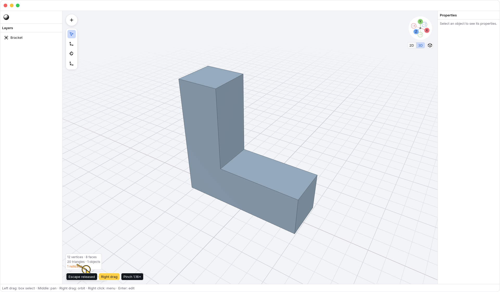
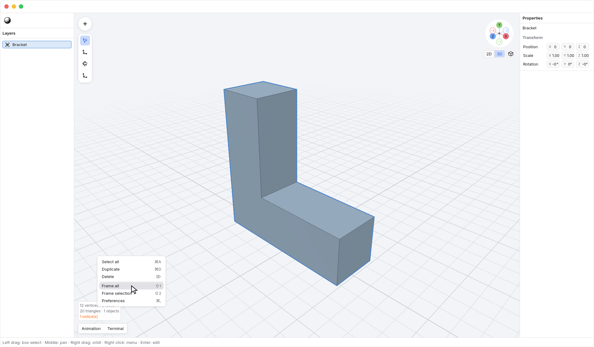
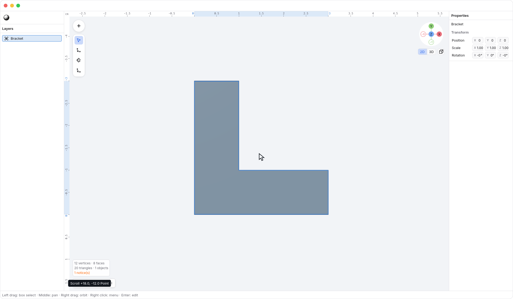
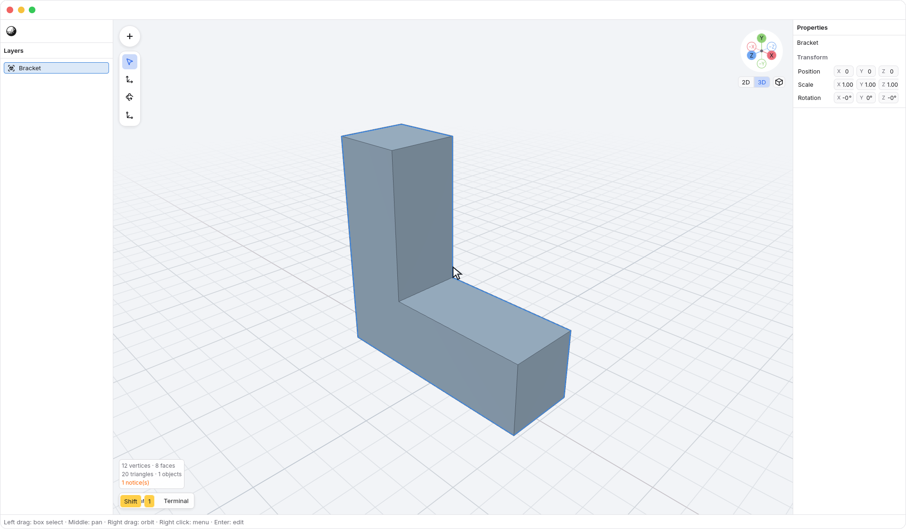
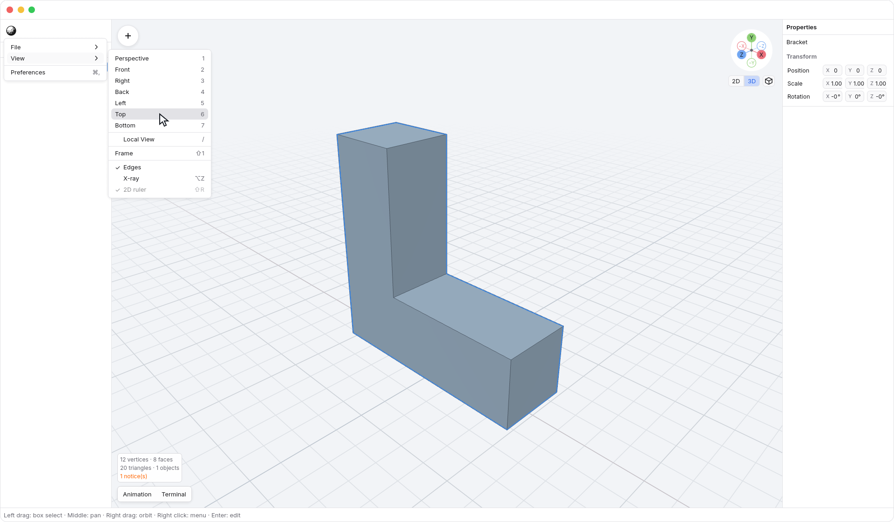
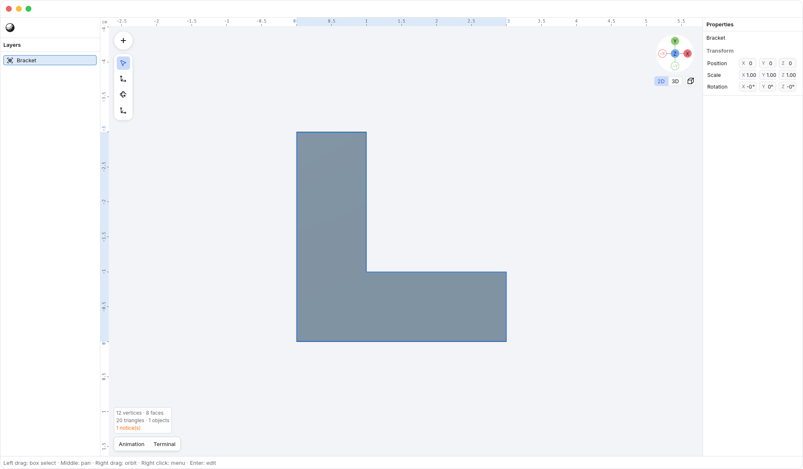

<!-- Generated by `just docs update`; edit docs/templates/*.md.in and src/documentation/scenarios/*.rs. -->

# Moving around

Move the pointer over <code>Viewport</code>:

- Drag the **left mouse button** to draw a selection box. Selection updates when
  you release; object bounds only need to intersect the box. With a
  [transform axis lock](numeric-transforms.md), it previews the chosen Move,
  Rotate, or Scale operation instead.
- Drag the **middle mouse button** to pan.
- Drag the **right mouse button** to orbit.
- Hold <kbd>Space</kbd> with a left-button drag to [pan](hand-tool.md), or hold
  <kbd>Option</kbd> with a left-button drag to [orbit](orbit-tool.md).

These bindings work in object and vertex edit modes with every tool. Drag a
transform handle when you want to transform a selection. See
[selecting objects](object-feedback.md) and [editing](editing.md).
Apply or cancel a pending [transform session](numeric-transforms.md) before camera navigation
or background selection.

Press and release the right button within **4
logical pixels** to open the viewport menu without moving the camera. It offers
<code>Viewport → Frame all</code> and <code>Viewport → Preferences</code>. Once a right
drag crosses that distance, releasing opens no menu, even if the pointer has
returned to its starting point.

In **2D mode**, **two-finger scrolling pans** and keeps the 2D ruler visible in a
settled axis view. Hold <kbd>Option</kbd> and left-drag to orbit into 3D.
On a trackpad, this is a click-drag while <kbd>Option</kbd> is held.
<kbd>Shift</kbd> + two-finger scrolling pans in either mode.

In **3D mode**, two-finger scrolling orbits and <kbd>Shift</kbd> with scrolling
pans. This applies even if the camera is still perfectly aligned or
orthographic. Choose the mode with the [gizmo's 2D/3D tabs](gizmo.md); clicking
an axis or choosing an axis preset enters 2D.
The 3D tab restores your previous 3D orientation and perspective by default,
keeping the current pan and zoom. Manual orbit continues from the visible
angle; it does not perform that recall. The gizmo preferences configure the
3D tab's return behavior.

Pinching and a mouse wheel zoom. In **2D mode**, zoom keeps the point beneath
the pointer in place. <kbd>Command</kbd> + two-finger scrolling also zooms
around the pointer; ordinary two-finger scrolling pans. In **3D mode**, zoom
stays centered on the camera target.

A two-finger twist is ignored in **2D**, so a
twist during panning or pinching cannot switch the view to 3D. In **3D**, twisting
rotates the view. Panning
and zooming preserve the viewing direction. These trackpad bindings work in
object and vertex edit modes.

1. Press <kbd>Shift</kbd> + <kbd>1</kbd> or choose <code>N3 → View → Frame</code> in <code>N3 → View</code> to fit and recenter
   the model and restore its default viewing angle.

2. Open <code>N3 → View</code> and point at <code>N3 → View → Top</code> to find a preset.
   Choose it, <code>N3 → View → Front</code>, <code>N3 → View → Right</code>, or
   <code>N3 → View → Perspective</code> to change the view with the current animation settings.

For the separate top-row and numpad bindings, orbit steps, and fitting a
selection, see [number keys and fitting the view](view-keys.md).

Click the <code>Axis gizmo → Projection</code> cube button beside the gizmo's 2D/3D tabs, or
press <kbd>0</kbd> to switch between perspective and orthographic
projection. The icon shows the current projection; see the [gizmo guide](gizmo.md#projection)
for both states. <code>N3 → View → Edges</code> and <code>Preferences → Grid</code> checkboxes control the
polygon boundaries and ground grid.

Open <code>N3 → Preferences</code> to find <code>Preferences → Precise scroll zooms (for Magic Mouse)</code>.
Enable it to make unmodified precise scrolling zoom in 3D mode. In 2D,
scrolling still pans, with or without <kbd>Shift</kbd>; hold
<kbd>Command</kbd> to zoom.

3. Use the front view to inspect the model straight on.

