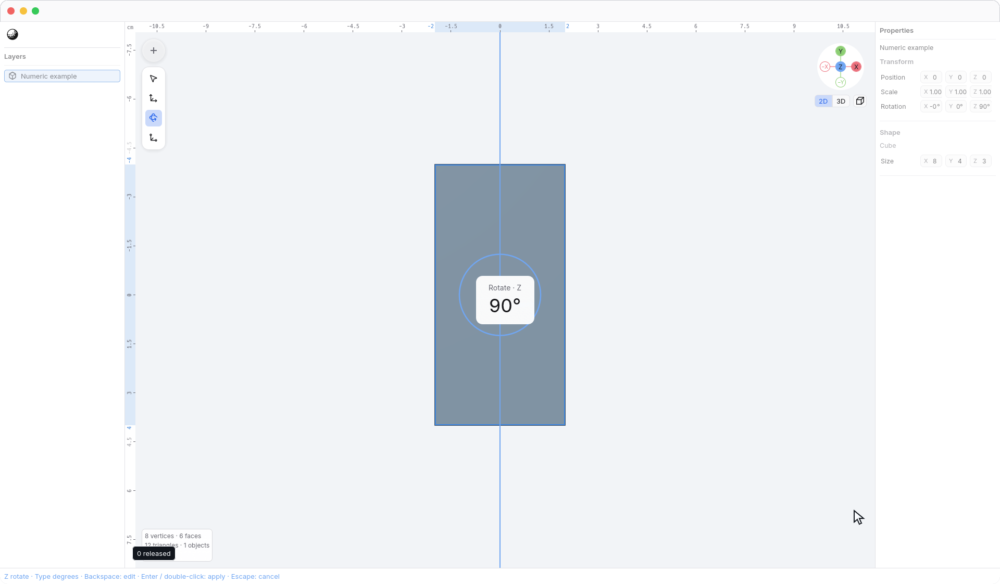
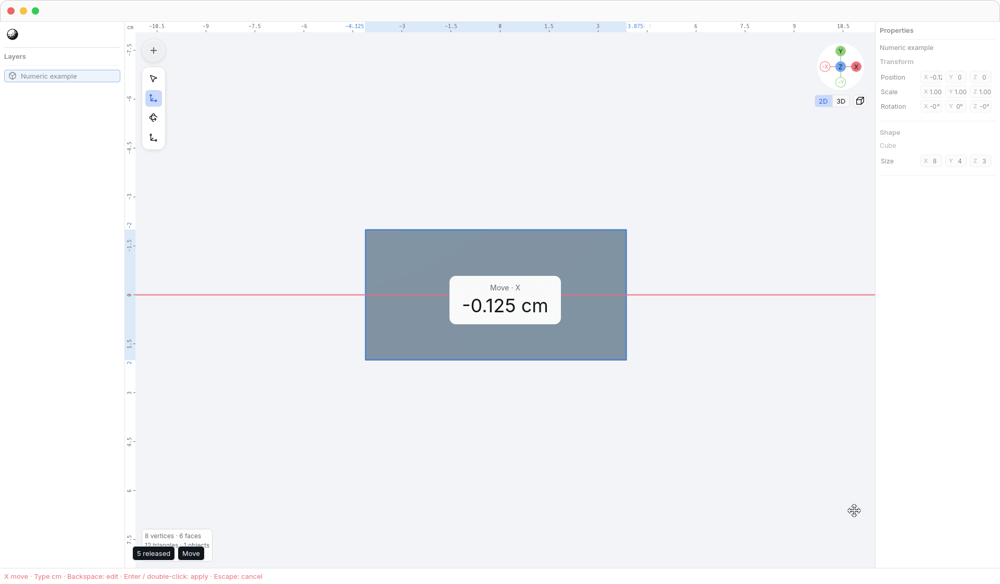
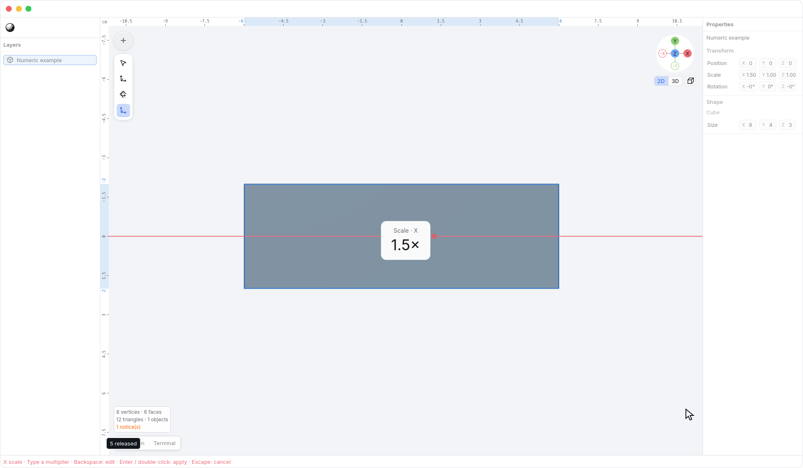

<!-- Generated by `just docs update`; edit docs/templates/*.md.in and src/documentation/scenarios/*.rs. -->

# Entering exact transforms

Select an object or editable vertices, then choose <code>Tools → Move</code> (<kbd>W</kbd>),
<code>Tools → Rotate</code> (<kbd>R</kbd>), or <code>Tools → Scale</code> (<kbd>E</kbd>). Lock an axis
with <kbd>X</kbd>, <kbd>Y</kbd>, or
<kbd>Z</kbd>, then type a number in the viewport.

No text field needs to be focused. The transform amount appears prominently in
the center of the viewport as <code>Rotate Z: 90°</code>, using larger text so
you can read it while working. Valid input previews immediately.

| Tool   | Meaning of the number                          | Example                                                |
| ------ | ---------------------------------------------- | ------------------------------------------------------ |
| Move   | Signed centimeters along the chosen world axis | `-0.125` moves by −0.125 cm                            |
| Rotate | Signed degrees around the chosen world axis    | `90` rotates by 90°                                    |
| Scale  | A positive multiplier on the chosen axis       | `1.5` makes that dimension 1.5 times its starting size |

For example, choose <code>Tools → Rotate</code>, press <kbd>Z</kbd>, and type `90`. Each digit updates the
same preview; you do not need to hold or drag a handle.

Press <kbd>Enter</kbd> or **double-click the viewport** to accept the complete session
as one Undo step. <kbd>Escape</kbd> cancels it and restores the starting geometry.
The axis lock and numeric input clear when the session ends. <kbd>Enter</kbd> does not also
enter vertex editing; its next idle press can do that.

You can orbit, pan, zoom, or use the view controls while inspecting a numeric
preview. Camera navigation preserves the amount, axis lock, and original
starting geometry. Accepting or cancelling the transform keeps your current view.
Number keys still edit the amount while numeric input owns them.

Move accepts fractional centimeters even when [snapping](snapping.md) is on.
Changing the display unit does not change the meaning of a viewport number:
`0.125` still means 0.125 cm. Position fields continue to accept explicit unit
suffixes when you need them.

Scale is a multiplier, not a length or percentage. `1` keeps the original size;
`0.5` halves it. Zero and negative scale factors are invalid and cannot be
accepted. For a single object, the chosen scale axis follows that object's local
axes, matching its scale handles. For editable vertices it uses a world axis.
Axis scaling of several objects is deliberately unavailable for now; their
existing uniform scale handle remains available.

**The number is the total amount from the start of the session.** If you first
drag by 0.4 cm and then type `2`, the complete move becomes 2 cm, not 2.4 cm.
Earlier drags or nudges in that session are replaced by the typed amount.
You can edit the number with <kbd>Backspace</kbd>; clearing the whole number restores
the starting geometry. Changing to another axis reapplies the
same number from the original starting state. Pressing the same axis again
removes the constraint and clears the numeric preview back to that starting
state; finish or cancel the remaining session before selecting other geometry.

Numeric input owns number keys, decimal point, minus, and <kbd>Backspace</kbd> only while
a transform axis is active and the viewport accepts keyboard input. Other times,
number keys retain their view shortcuts, <kbd>.</kbd> toggles 2D/3D, and
<kbd>Backspace</kbd> deletes the contextual selection. Editing a text field does not
also transform geometry. Unit suffixes, percentages, and arithmetic expressions
are not supported by viewport numeric entry yet.

See [moving along axes](axis-locks.md), [editing](editing.md), or
[length units](length-units.md). [Back to guide](README.md).
