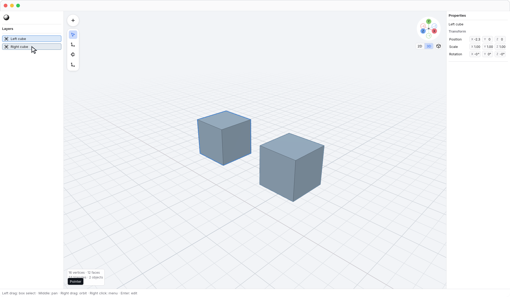
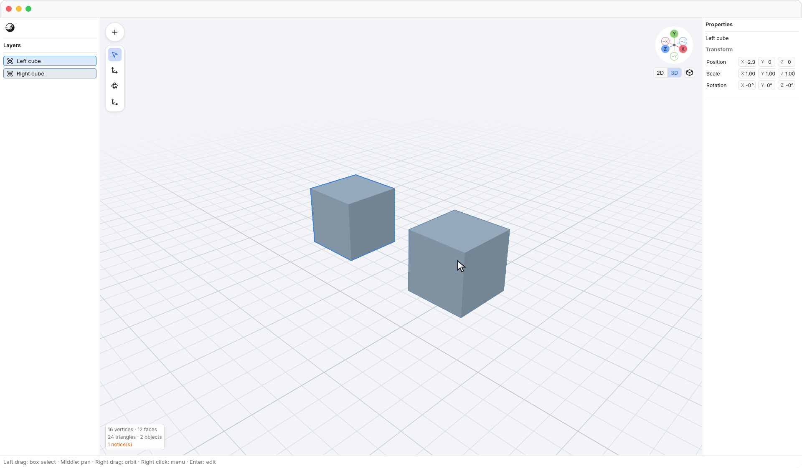
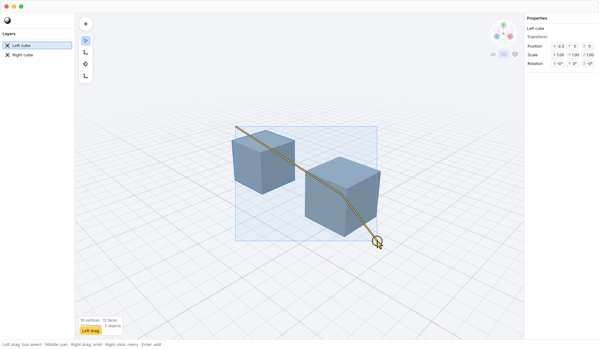
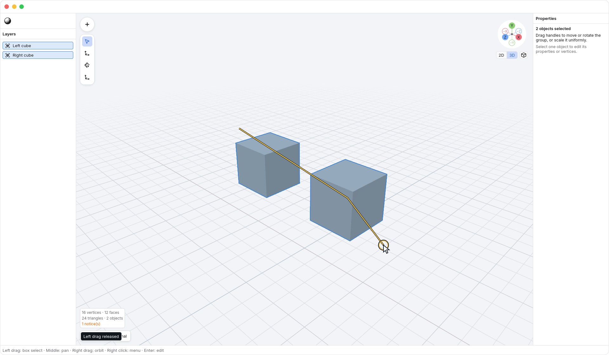
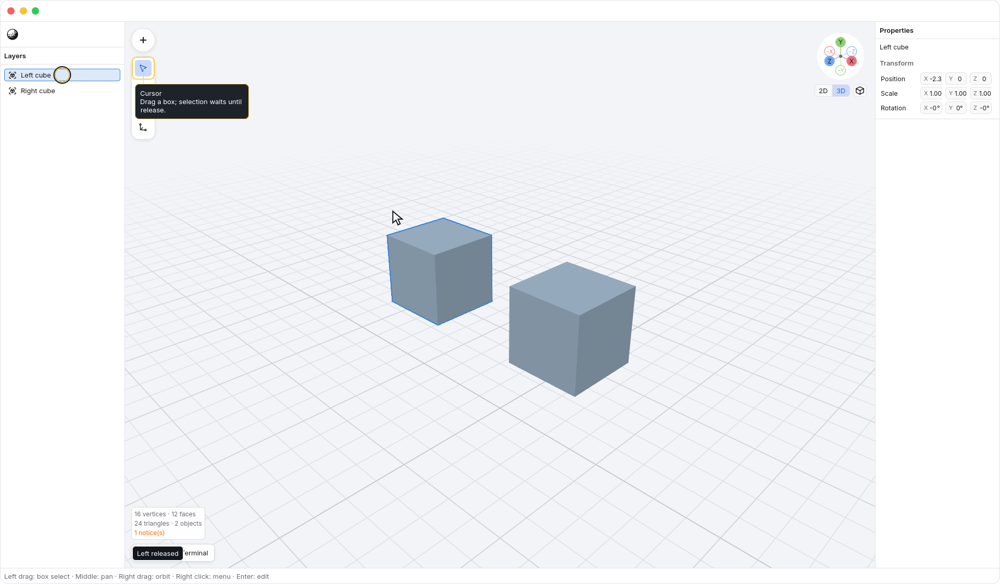

<!-- Generated by `just docs update`; edit docs/templates/*.md.in and src/documentation/scenarios/*.rs. -->

# Finding and selecting objects

In object mode, move the pointer over an object in <code>Viewport</code> or its
row in <code>Layers</code>. A thin, subdued blue outline previews the object
under the pointer. Its matching row highlights too; hovering does not select it.

Click a visible surface or its Layers row to select that object. A plain click
replaces the previous selection. Selection uses
a stronger blue outline and takes priority when the pointer is over that same
object. You can keep one object selected while hovering another.

Move from a Layers row onto its object in the viewport: the feedback stays
connected to the same object. The selected left cube and hovered right cube
below retain their outlines with <code>N3 → View → Edges</code> turned off. Edges controls
the polygon overlay independently of these object outlines.

With no [Move axis lock](axis-locks.md), drag the **left mouse button** to select several objects with a box, with any
tool selected. Selection stays unchanged while you drag; hover previews stay
hidden so they do not compete with the box.

Release to select objects whose projected bounds **intersect** the box, even
if the box crosses only part of an object. With [X-ray](xray.md) off, at least
one vertex of each object must be visible. Enable X-ray to include occluded
objects too. Every selected object gets the stronger outline and a selected
Layers row. Hold <kbd>Shift</kbd> when starting the box to add to your selection.
Press <kbd>Enter</kbd> to accept a held box early, or <kbd>Escape</kbd> to cancel it and keep
the previous selection. Hover previews return after the gesture ends.

Watch the selection stay unchanged during the drag and update when the button is released.

Moving over empty viewport space clears the hover preview and keeps the current
selection. In vertex edit mode, object outlines are hidden and the edited
object's Layers row stays selected. Hover and selection
do not change geometry or add undo steps.

See [editing geometry](editing.md) or [navigation](navigation.md).
[Back to guide](README.md).
