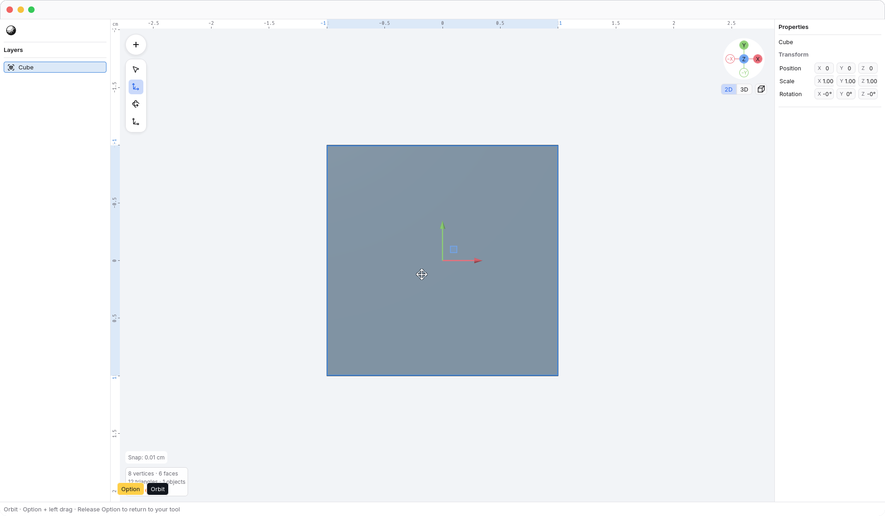
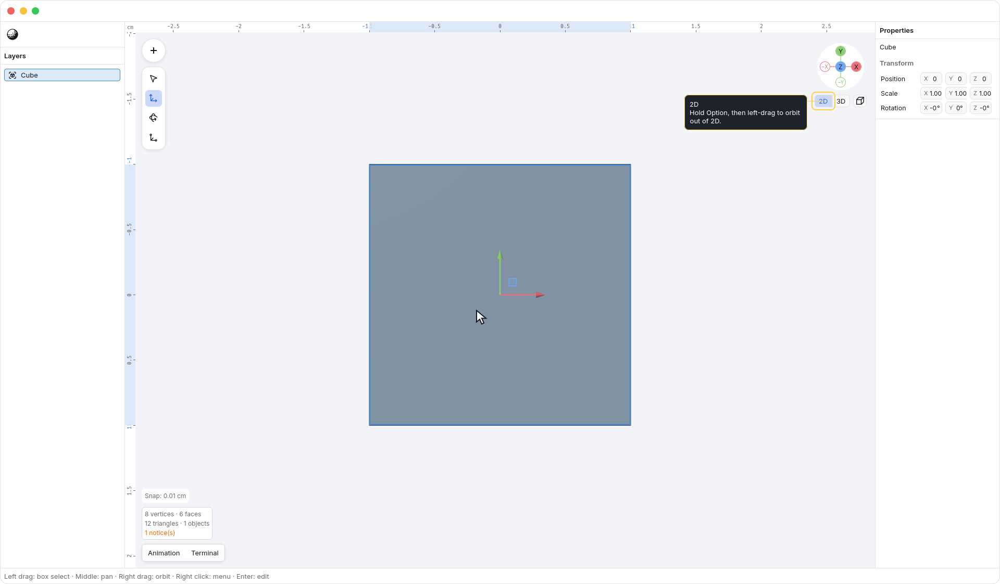

<!-- Generated by `just docs update`; edit docs/templates/*.md.in and src/documentation/scenarios/*.rs. -->

# Orbiting with the temporary orbit tool

Move the pointer over <code>Viewport</code> and hold <kbd>Option</kbd>.
Then click-drag with the left mouse button or trackpad to orbit. Your selected
View, Move, Rotate, or Scale tool stays selected, and geometry and selection
remain unchanged. This works in object and vertex edit modes.

Holding <kbd>Option</kbd> alone, or clicking without dragging, leaves the camera in place.

In **2D**, start an <kbd>Option</kbd>-drag to orbit into **3D** and hide the 2D ruler. The
orbit starts from the angle you see and keeps the current projection. It does
not recall your previous 3D orientation; the [gizmo's 3D tab](gizmo.md) does that.

Release <kbd>Option</kbd> to stop orbiting and return to your selected tool. This also
works while the left button is still down: further pointer movement and the
remaining button release cannot select or transform anything.

Use <kbd>Space</kbd> + left-drag to [pan with the hand tool](hand-tool.md). <kbd>Space</kbd> takes
priority if <kbd>Space</kbd> and <kbd>Option</kbd> are both held before you start dragging. Once a
drag starts, it keeps its original action until you release its modifier or
the button. Adding another modifier never switches that drag to another action.

Hold the modifier before starting a drag. An existing selection box or transform
keeps control if <kbd>Option</kbd> is pressed afterwards. Apply or cancel a pending
[transform session](numeric-transforms.md) first. Text fields, popups, and
controls keep their input, and leaving the application clears the held tool.
<kbd>Option</kbd>-drag currently orbits over objects as well as empty viewport space;
it does not duplicate objects.

<kbd>Shift</kbd> + two-finger scroll always pans, in both 2D and 3D. Unmodified
scrolling pans in 2D and retains its usual 3D behavior. <kbd>Option</kbd> changes the
left-button drag, not the scroll gesture.

See [navigation](navigation.md). [Back to guide](README.md).
