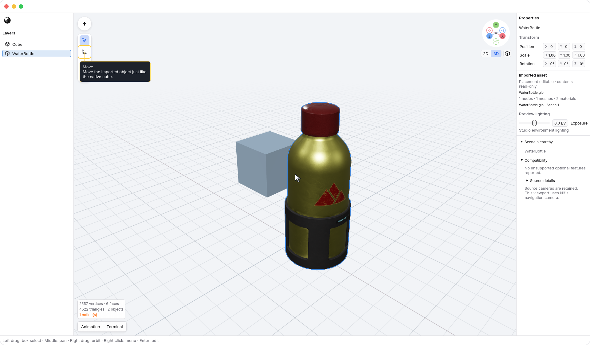
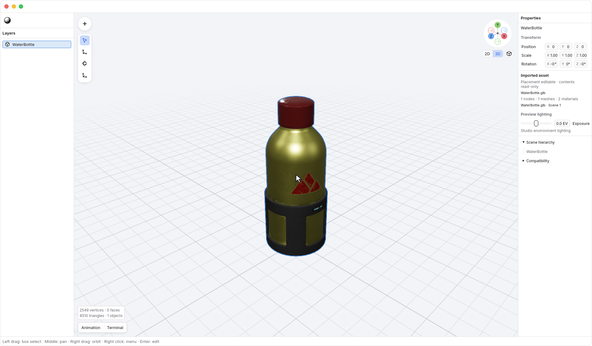

<!-- Generated by `just docs update`; edit docs/templates/*.md.in and src/documentation/scenarios/*.rs. -->

# Imported assets

Open a `.glb` or `.gltf` file to place its scene in an N3 document. Use
<code>N3 → File → Import…</code> to add one beside objects already in your document. Imported
assets appear in Layers and share ordinary selection, placement, duplication,
deletion, and undo with native geometry. Their internal meshes, materials, and
animation remain read-only.

## Place an asset

Select the asset object and use Move, Rotate, or Scale to adjust its placement.
Here, a water bottle is imported beside a native cube, moved with
<kbd>W</kbd> and <kbd>X</kbd>, then restored with
<kbd>Command</kbd> + <kbd>Z</kbd> and <kbd>Shift</kbd> + <kbd>Command</kbd> + <kbd>Z</kbd>:

These edits affect the placed object. Entering vertex edit does not silently
convert the asset to a mesh or change its source file.

Use <code>N3 → File → Save</code> or <code>N3 → File → Save as…</code> to save the document
as `.n3.json`. N3 stores the asset reference and placement, not an embedded copy
of its source data. References are relative to the saved document when possible;
Save As keeps them pointing at the same source. Keep the linked files with your
document when moving the project, including a `.gltf` file's external buffers
and textures.

Assets are loaded as a snapshot. Changes to their source files appear when you
reopen the document. If a source is missing or cannot load, its object remains in
Layers: restore the files and reopen to recover the preview.

## Inspect the contents

With an asset selected, expand <code>Properties → Scene hierarchy</code> in Properties to see
its source nodes. To see its materials, switch to Cursor
(<kbd>V</kbd>), hold <kbd>Z</kbd> over the viewport,
point down at <code>Shading → Material Preview</code>, and release. Solid is the
default inspection mode; Material Preview shows imported materials and texture
maps. Turn off <code>N3 → View → Edges</code> for a clear material preview. This water bottle
uses its imported material and texture maps:

Orbit, pan, and zoom using the same viewport controls as native geometry. Adjust
<code>Properties → Exposure</code> for a brighter or darker preview. Imported cameras are
retained in the source data; the editor continues to use its navigation camera.

Material Preview uses studio environment lighting alongside asset lights when
available. Materials may look different in another application's environment or
final render.

See [viewport shading](shading.md) to compare the modes. The illustrations here
use Material Preview, including the native cube's editor-material fallback.

## Inspect animation

Select an imported asset and choose <code>Tool Dock tab bar → Animation</code> in the Tool Dock
tab bar to open the Animation panel. The Tool Dock stays closed until you open
it; use <code>Tool Dock tab bar → Close Tool Dock</code> to close it again. A static asset has no clip to play.
Use the timeline to play a source clip, scrub through poses, and inspect its
keys. These previews leave the document and its undo history unchanged.
See [inspecting animation](animation.md) for joint and morph examples.

## Check compatibility

Expand <code>Properties → Compatibility</code> to review reported unsupported optional
features. An asset that requires an unsupported extension cannot be previewed as
if that feature were present. Editing the asset's contents and exporting glTF are
not available yet.

[Back to guide](README.md).
