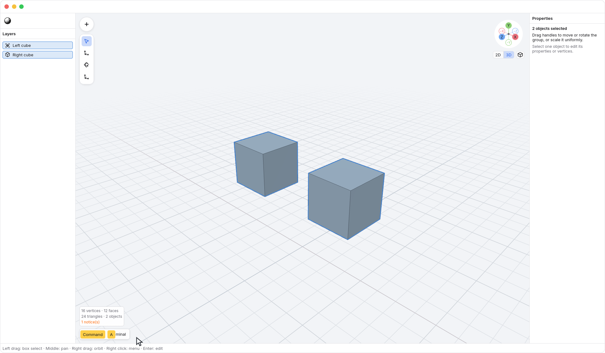
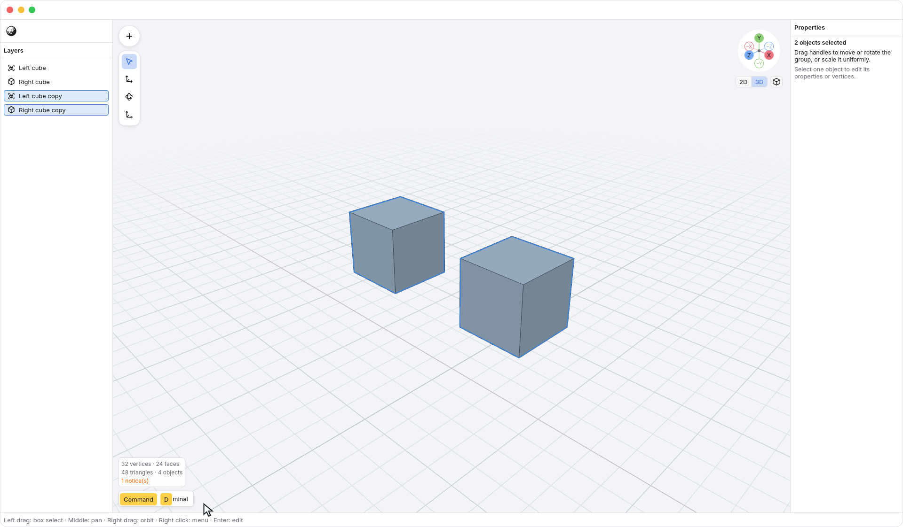
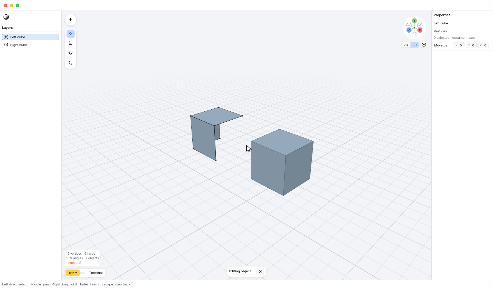

<!-- Generated by `just docs update`; edit docs/templates/*.md.in and src/documentation/scenarios/*.rs. -->

# Selecting, duplicating and deleting with keys

Click <code>Viewport</code> to give it keyboard focus. <kbd>Tab</kbd>
selects the first item when nothing is selected, advances to the next item,
and wraps at the end. <kbd>Shift</kbd> + <kbd>Tab</kbd> goes backwards. Object
cycling follows <code>Layers</code> order; vertex cycling follows the mesh's
vertex order. With [X-ray](xray.md) off, it includes only currently visible
vertices; with X-ray on, it also reaches vertices behind surfaces.

Press <kbd>Command</kbd> + <kbd>A</kbd> to select all objects in object mode, or all
eligible vertices of the mesh in vertex edit mode, following the same X-ray
rule. [Local View](local-view.md) limits object selection to the isolated objects.
Selecting does not change the model or create an undo step.

Press <kbd>Command</kbd> + <kbd>D</kbd> in object mode to make independent copies of
the selected objects. The copies stay in the same positions and become the new
selection; the originals stay unchanged. Live primitives remain live. The new
**copy** rows in <code>Layers</code> distinguish the overlapping objects.
Duplication does not start a move: choose a transform when you want to separate
the copies.

One <kbd>Command</kbd> + <kbd>Z</kbd> removes the whole duplicate group; <kbd>Shift</kbd> + <kbd>Command</kbd> + <kbd>Z</kbd> restores
it. You can also right-click for <code>Viewport → Duplicate</code>. Duplicate is
unavailable without an object selection, in vertex mode, or while another editing
interaction is unfinished.

Press <kbd>Delete</kbd> or <kbd>Backspace</kbd> to delete the
selection. In object mode this removes the selected objects. In vertex mode
it removes the selected vertices and every face that uses them. It keeps the
remaining vertices and the object; it does not fill holes or repair the mesh.

Use <kbd>Command</kbd> + <kbd>Z</kbd> to undo the whole deletion, or <kbd>Shift</kbd> + <kbd>Command</kbd> + <kbd>Z</kbd> to redo it.
You can also right-click the viewport for <code>Viewport → Select all</code> and
<code>Viewport → Delete</code>.

While entering a [numeric transform](numeric-transforms.md), <kbd>Backspace</kbd> edits
the amount instead of deleting selected geometry.

Text fields, popups and dialogs keep their keyboard controls. <kbd>Tab</kbd> cycles model
selection only while the viewport has keyboard focus; elsewhere it navigates
the interface.

See [selecting objects](object-feedback.md) or [editing geometry](editing.md).
[Back to guide](README.md).
