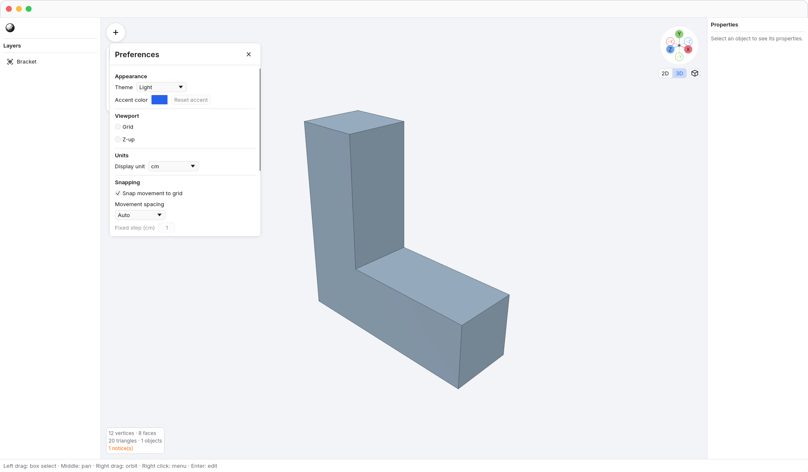
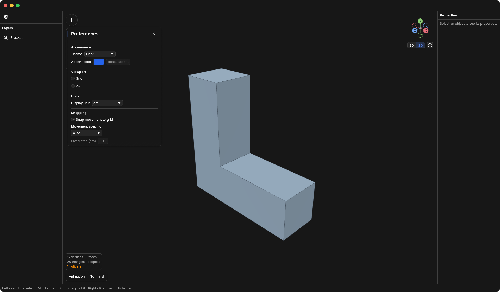
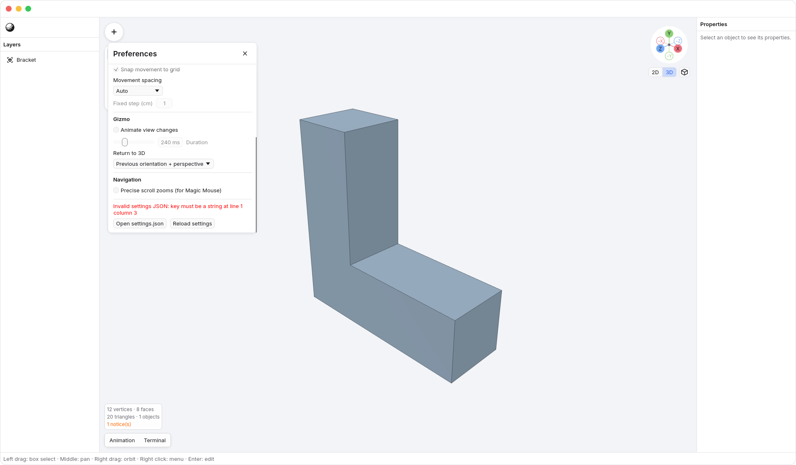

<!-- Generated by `just docs update`; edit docs/templates/*.md.in and src/documentation/scenarios/*.rs. -->

# User settings

Preferences apply to every N3 document and survive app launches. Open
<code>N3 → Preferences</code> from the N3 menu, press <kbd>Command</kbd> + <kbd>,</kbd>,
or use the gizmo's context menu. The shortcut opens Preferences even when the UI
is hidden; pressing it again keeps the window open.
The title sits at the left of the Preferences header, with its close button at the right.
Changes take effect immediately; completed adjustments save automatically.
Choose Display unit here. Centimeters are the default;
length inputs show bare numbers, and the chosen unit determines what an
unsuffixed number means. You can still type an explicit unit suffix.

Under Appearance, choose System, Light, or Dark in
<code>Preferences → Theme</code>. System is the default and follows macOS
appearance changes while N3 is open. Light and Dark keep the chosen appearance
regardless of the OS setting. Use <code>Preferences → Accent color</code> for a personal
highlight color, or <code>Preferences → Reset accent</code> to restore N3's default.
N3 may adjust the displayed accent's lightness for contrast; the saved color stays the
chosen `#RRGGBB` value.
The viewport background follows the theme; mesh lighting and materials do not
change. Dark uses neutral gray surfaces. Accent highlights, axis colors, and
error colors keep their own meanings.
Under Viewport, <code>Preferences → Z-up</code> displays the source Z axis vertically for the
current view. It does not alter geometry and resets when you open or create a document.

The same Preferences window with an explicit Light choice:



With an explicit Dark choice:



Choose <code>Preferences → Open settings.json</code> to open the same preferences as text
in your default text editor. N3 creates the file if it does not exist:

```text
~/Library/Application Support/N3/settings.json
```

There is one global user settings file. N3 does not read project or workspace
settings. People and agents can edit this file directly. Save the text to apply
changes; N3 checks periodically and on focus return. Changes wait until an active
drag, edit session, or text entry finishes.

## Settings format

Use a JSON object with dotted keys. This is plain JSON: comments and trailing
commas are not supported. You may omit keys to use their defaults. The complete
defaults are:

```json
{
  "appearance.accentColor": "#2563EB",
  "appearance.theme": "system",
  "display.lengthUnit": "cm",
  "navigation.animateViews": true,
  "navigation.preciseScrollZoom": false,
  "navigation.returnTo3D": "both",
  "navigation.viewDurationMs": 120,
  "snapping.enabled": true,
  "snapping.mode": "auto",
  "snapping.stepCm": 1.0,
  "viewport.showEdges": true,
  "viewport.showGrid": true
}
```

- `viewport.showGrid` and `viewport.showEdges` control grid and edge display.
- `navigation.preciseScrollZoom` selects precise-scroll zooming in Free navigation.
- `navigation.animateViews` and `navigation.viewDurationMs` control view transitions.
  Duration must be an integer from 0 to 1000 milliseconds; zero is instant.
- `navigation.returnTo3D` accepts `perspective`, `orientation`, or `both`.
- `snapping.enabled` turns movement snapping on or off. `snapping.mode` accepts
  `auto` or `fixed`; `snapping.stepCm` is a positive, finite fixed increment in
  centimeters. Exact typed transform values remain exact.
- `display.lengthUnit` accepts `mm`, `cm`, `m`, `in`, or `ft`. It changes display
  and input units without resizing geometry. New and Open preserve this choice.
- `appearance.theme` accepts `system`, `light`, or `dark`. System follows the OS
  appearance; the other choices override it.
- `appearance.accentColor` is an `#RRGGBB` color used for interface emphasis.
  Resetting the accent restores the default value.

Camera position, the current projection, selection, panel layout, and temporary
tool state are not settings. Z-up remains a per-view presentation choice and
resets when opening or creating a document.

## Editing and recovery

N3 merges changes to different settings and preserves unknown keys when the UI
saves. If you and an external editor change the same setting differently, N3
reports a conflict instead of silently replacing the file. UI saves may reformat
the JSON; whitespace is not preserved.

Invalid JSON or invalid values leave the current preferences active. The error
appears in Preferences, and the file is kept intact so you can repair it.
<code>Preferences → Reload settings</code> rereads the file and discards pending
unsaved preference changes when the file is valid. It does not affect your model
or its undo history. Deleting the file restores the defaults at the next idle
reload when there are no pending local preference changes.



See [axis gizmo](gizmo.md), [snapping](snapping.md), and [length units](length-units.md).
[Back to guide](README.md).
