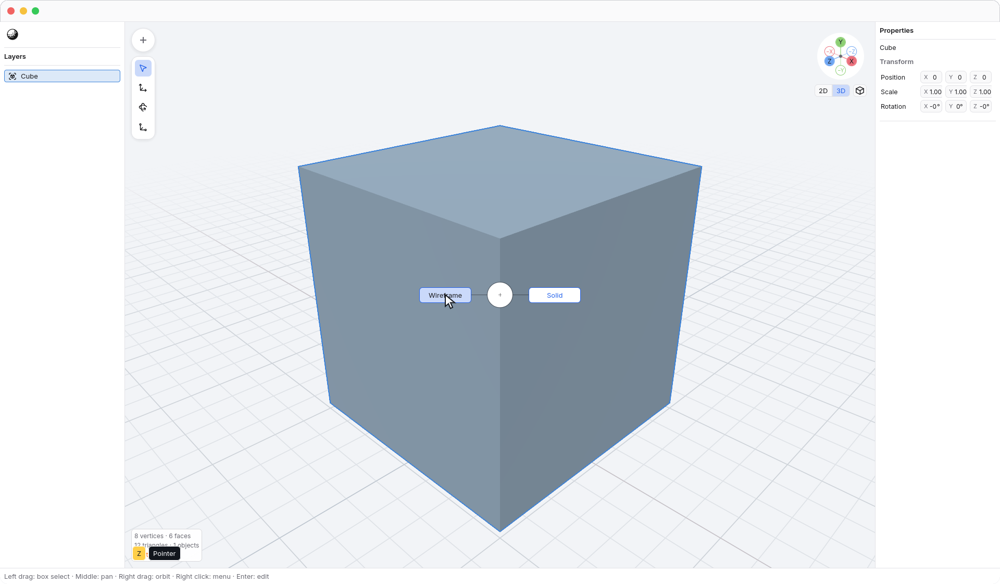
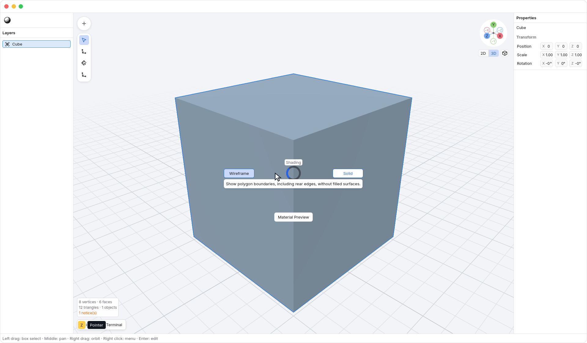
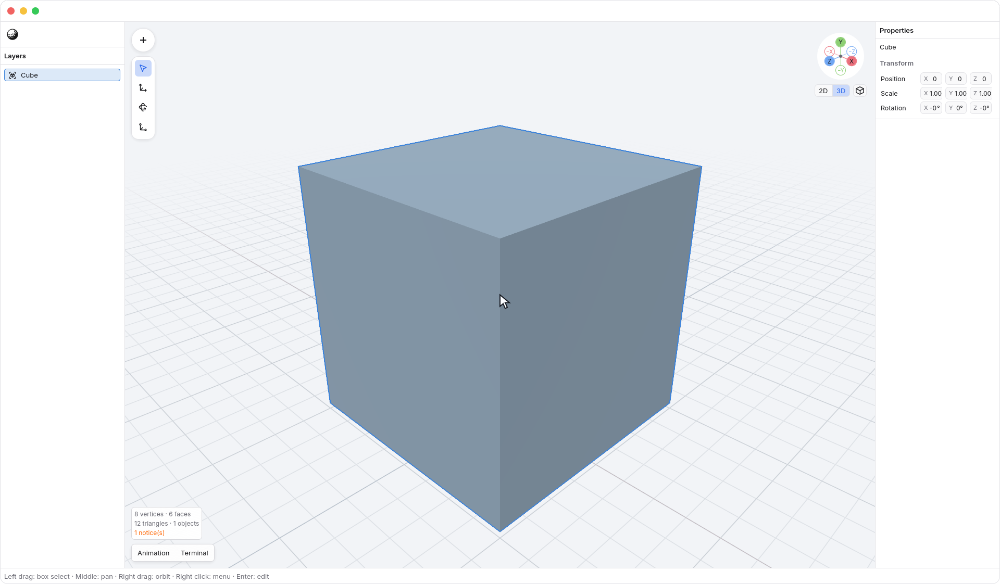
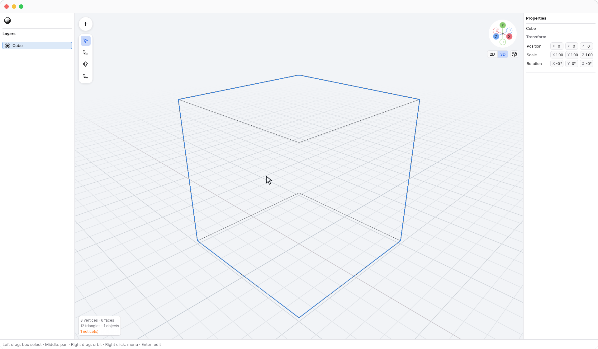
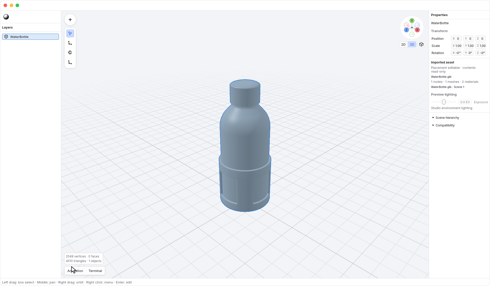
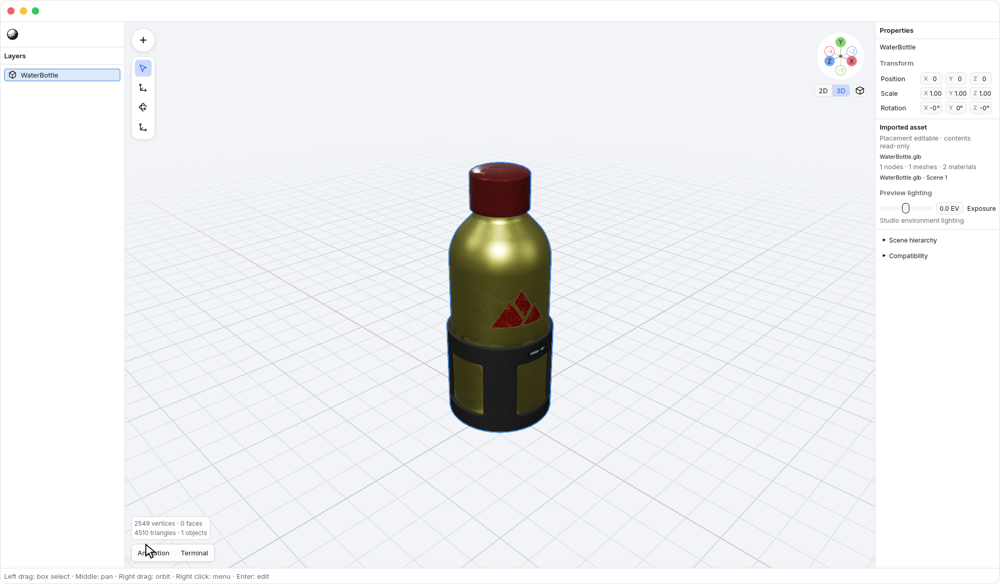

<!-- Generated by `just docs update`; edit docs/templates/*.md.in and src/documentation/scenarios/*.rs. -->

# Viewport shading

With the Cursor tool (<kbd>V</kbd>), move the pointer over
<code>Viewport</code> and hold <kbd>Z</kbd>. Point left at
<code>Shading → Wireframe</code>, right at <code>Shading → Solid</code>, or down
at <code>Shading → Material Preview</code>, then release the key to apply your
choice. No click is needed.
The **Shading** name appears above the center, and the current mode is marked.
The buttons face a circular opening and extend outward from it.
The ring's highlighted segment follows the pointer's direction, including empty sectors.
Pause in a sector to see its tooltip,
even when the pointer is outside its button.
The pie stays inside the window and can extend over the side panels when opened
near a viewport edge.

**Solid** shows opaque surfaces with neutral inspection shading. This is the
default view, including for imported assets. It keeps surface shape readable
without using imported textures, transparency, or material lighting.

**Wireframe** shows the mesh's polygon boundaries, including rear edges, without
filled surfaces. It does not add diagonals across the original polygons.
Imported triangle meshes show their existing triangle boundaries.

**Material Preview** displays imported materials and texture maps with studio
lighting. Native meshes keep their editor material until material authoring is
available. Here is the same imported water bottle in Solid:

And in Material Preview, with the same geometry, selection, and camera:

Material Preview is for inspection; it is not a final render. A Rendered mode is
not available yet.

Wireframe is a display mode. With [X-ray](xray.md) off, vertex selection still
uses the visible surface; rear vertices do not become selectable through the
mesh. Enable X-ray separately to select through surfaces. Switching shading does
not change geometry, selection, the camera, or undo history. The ordinary edge
display preference for Solid remains unchanged.

Hovering a choice does not apply it yet. Return to the opening point before
releasing to cancel, point into the empty upper direction, or press
<kbd>Escape</kbd>.

In Move (<kbd>W</kbd>), Rotate (<kbd>R</kbd>), and Scale
(<kbd>E</kbd>), <kbd>Z</kbd> remains the Z-axis lock
and never opens this pie, even with no selection. Switch to Cursor first.
Text fields, open menus, and active gestures keep their own input.

See [imported assets](scene-viewer.md), [editing geometry](editing.md), or
[reading vertex selections](edit-selection.md).
[Back to guide](README.md).
