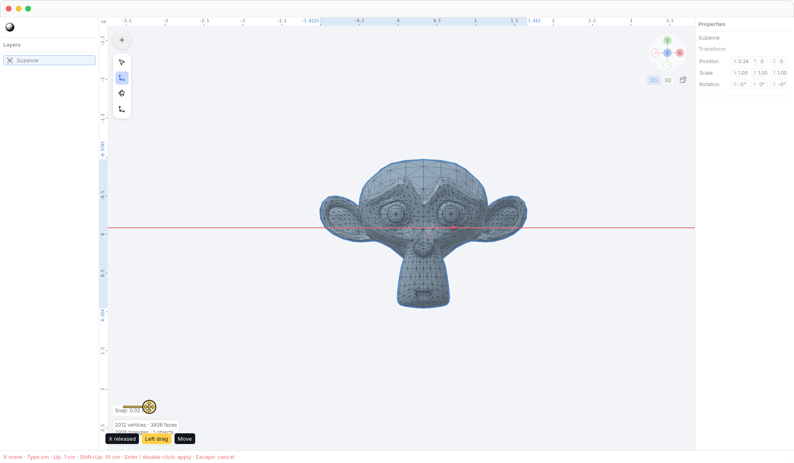
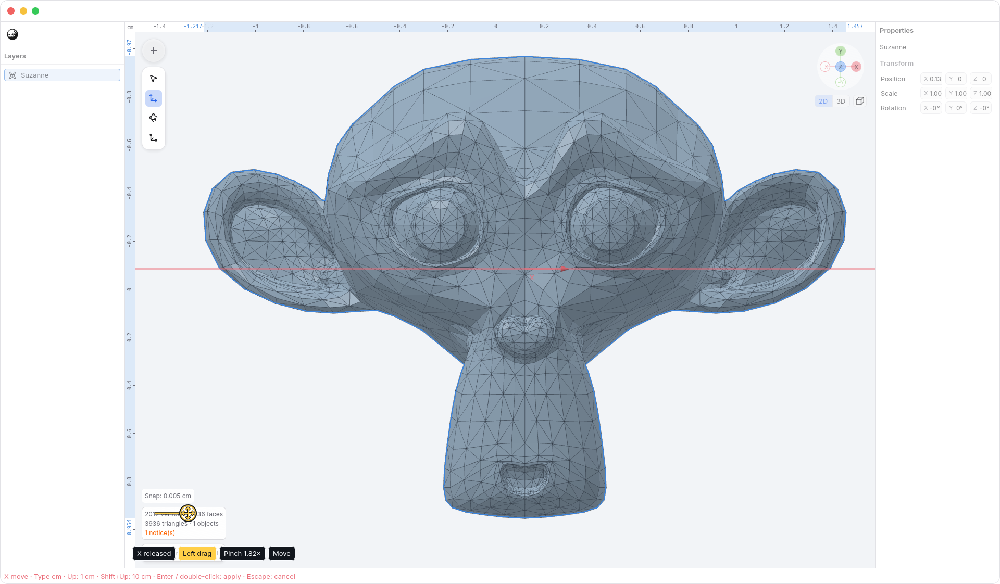
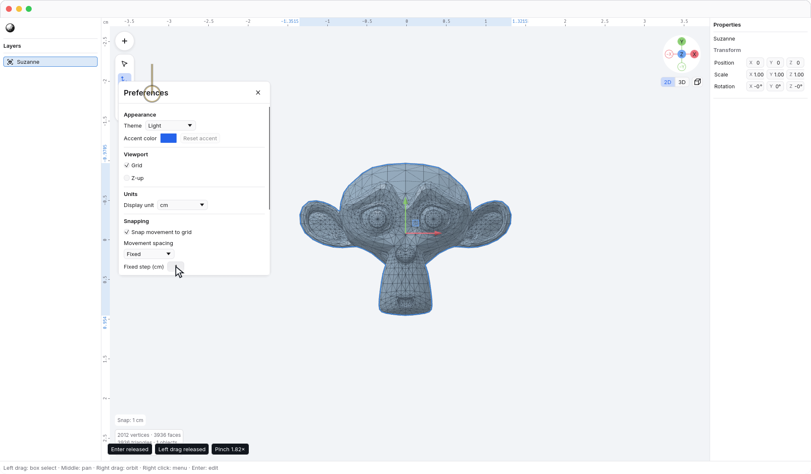
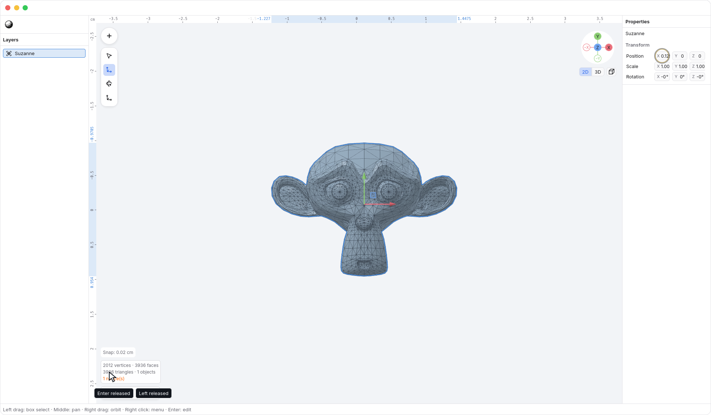

<!-- Generated by `just docs update`; edit docs/templates/*.md.in and src/documentation/scenarios/*.rs. -->

# Snapping movement

Movement uses **Auto snapping by default**. It chooses a clean centimeter
increment for the current view: zoom in for finer movement, or zoom out for a
coarser step. The current step appears as <code>Snap: 0.02 cm</code> above
the scene stats at the viewport's bottom left. A move keeps that increment until
you release the pointer, so its
precision does not change halfway through a drag.

This example moves Suzanne with an X-axis lock. Its authored width is only
about 2.67 cm; Auto uses **0.02 cm** in this view rather than
forcing a one-centimeter jump.

After zooming in, the same pointer travel uses **0.005 cm**
increments. Auto works in both orthographic and perspective views. It depends
on the scale at the selection, not the size of the whole scene, the visibility
of the grid, or how far or fast you have dragged.

Open <code>Preferences → Movement spacing</code> in Preferences to choose Auto or Fixed.
<code>Preferences → Movement spacing → Fixed</code> uses the explicit <code>Preferences → Fixed step (cm)</code> interval
for pointer movement; choose it when a particular measurement grid matters.
<code>Preferences → Snap movement to grid</code> turns snapping off for continuous movement. These
preferences affect future movement, not existing geometry or document history.

Dragging a <code>Properties → Position X</code> field also uses clean increments.
In Auto, Position fields use 0.05 cm steps and vertex-delta fields use 0.02 cm
steps, derived from their drag sensitivity. Orbiting or zooming does not change
a numeric field's behavior. Changes preview immediately; one completed field
drag is one Undo step. Arrow keys remain explicit **1 cm** nudges, or **10 cm**
with a coarse nudge such as <kbd>Shift</kbd> + <kbd>Right</kbd>, independently of Auto or Fixed pointer spacing. With snapping enabled,
a nudge aligns an off-grid destination to the one-centimeter keyboard grid.
On-grid selections move by exactly the requested amount.

**Typed values remain precise.** Entering `0.125 cm` in a Position field keeps
that exact value even when movement snapping is enabled. Fractional centimeters
remain valid in the document. Primitive dimensions, rotations, and scales are
not rounded by this movement setting.

Only the active axes change. For several objects, the active object's origin
anchors the move and all selected objects receive the same displacement.
Selected vertices use their shared center. Their individual positions can still
be fractional: snapping moves the selection together without changing its shape.
An axis-locked Move keeps its usual session: <kbd>Enter</kbd> or a viewport double-click
accepts the complete preview, and <kbd>Escape</kbd> restores its starting state.

Changing the display to millimeters, meters, inches, or feet does not change the
canonical increment. Snapping to other geometry and modifier keys for finer or
coarser pointer snapping are deferred.

See [moving along axes](axis-locks.md), [length units](length-units.md), or
[editing](editing.md). [Back to guide](README.md).
