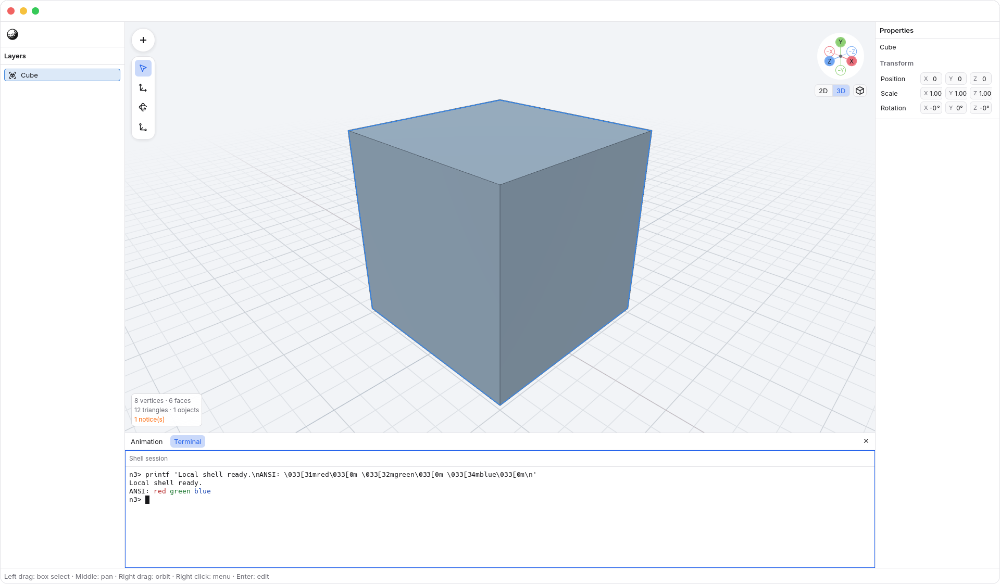
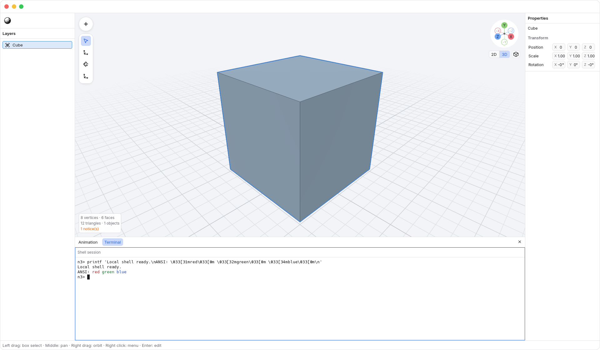
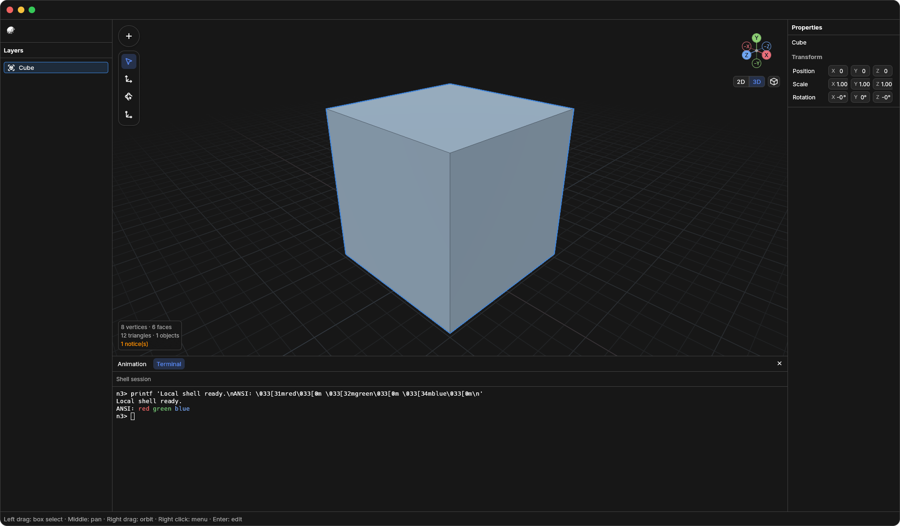

<!-- Generated by `just docs update`; edit docs/templates/*.md.in and src/documentation/scenarios/*.rs. -->

# Terminal

Choose <code>Tool Dock tab bar → Terminal</code> in the Tool Dock tab bar to open a local shell
in the Terminal panel. The Tool Dock is the shared container for Animation and
Terminal. Its tab bar floats near the viewport's lower-left when the Tool Dock
is closed; opening a panel moves the same controls into the Tool Dock header.

Click the terminal contents to focus them, type a command, then press
<kbd>Enter</kbd>. Commands run on your computer, using your shell; they are separate
from N3's modeling commands. Terminal input does not trigger viewport shortcuts.
<kbd>Tab</kbd>, arrow keys, <kbd>Escape</kbd>, and <kbd>Control</kbd>+<kbd>C</kbd>
are passed to the focused terminal. Click the viewport to resume N3 shortcuts.

This example runs `printf` in a controlled local shell. Its `n3>` prompt is set
for the illustration; your shell prompt and startup output may differ.

Scroll over the terminal to read earlier output, and drag the Tool Dock's upper
edge to change its height. The text grid and the shell's terminal dimensions
adjust to the available space.

Choose <code>Tool Dock tab bar → Animation</code> to switch to Animation, then
<code>Tool Dock tab bar → Terminal</code> to return. The panels share the Tool Dock and its
height. Clicking the active tab focuses that panel; it does not close the Tool
Dock. Use <code>Tool Dock tab bar → Close Tool Dock</code> to close the Tool Dock and restore the
floating Tool Dock tab bar. Closing the Tool Dock keeps the shell session alive;
returning to Terminal shows its current output.

Opening, focusing, resizing, and switching these panels do not edit the N3
document or add undo steps. Shell commands have their own effects outside N3's
Undo history. Terminal is not an N3 scripting API.

Terminal follows the application's Light or Dark appearance:

See [inspecting animation](animation.md) for the other Tool Dock panel.

[Back to guide](README.md).
