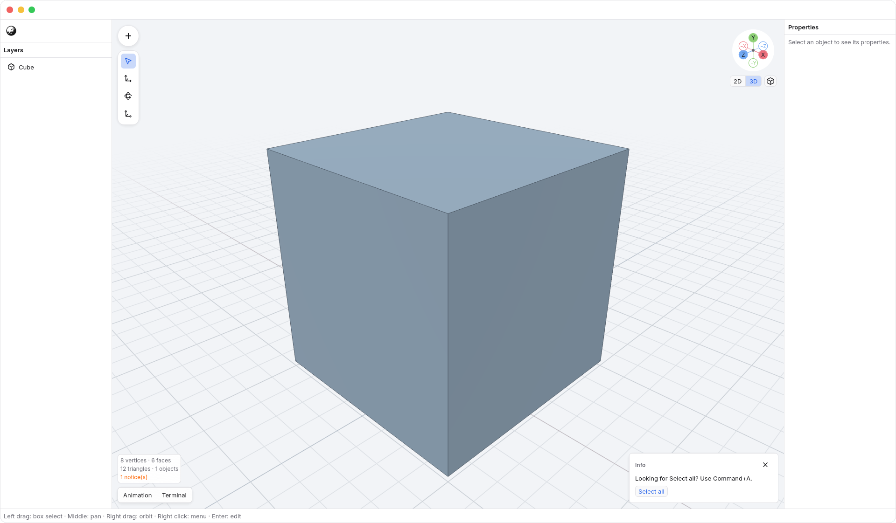
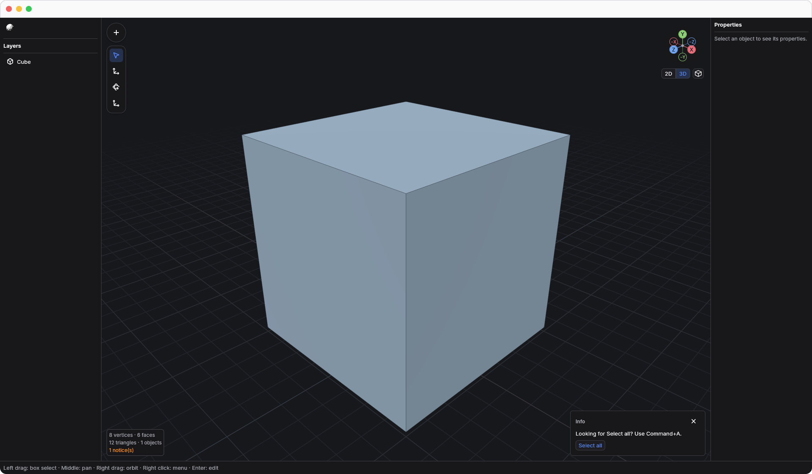

<!-- Generated by `just docs update`; edit docs/templates/*.md.in and src/documentation/scenarios/*.rs. -->

# Toasts and shortcut hints

Toasts are brief notifications at the bottom-right of the viewport. They can
offer an action, explain what happened, or give a small hint without opening a
dialog. They usually disappear automatically; hovering or focusing the stack
pauses its reading time. Notifications that need an explicit finish can stay
until dismissed or updated. New arrivals wait while you read the visible stack.
Use its X (<code>Dismiss notification</code>) to dismiss it yourself.

From the idle viewport, press <kbd>F6</kbd> to focus a toast's
action, or its X if there is no action. Use <kbd>Tab</kbd> and
<kbd>Shift</kbd>+<kbd>Tab</kbd> to move between controls, and <kbd>Enter</kbd> to
activate one. <kbd>Escape</kbd> returns focus without dismissing the toast. Closing
or acting on a focused toast also returns focus to where you were working.

## Shortcut hints

An unfamiliar shortcut can offer a hint when N3 has a specific alternative.
For example, press <kbd>A</kbd> in the viewport to see the hint for Select all:
N3 uses <kbd>Command</kbd> + <kbd>A</kbd>. The hint appears once per session and
does not select anything by itself. Choose <code>Select all</code> to run
Select all, or keep working and let the toast disappear.

The toast uses the current theme.

Text fields, menus, and active gestures keep their own keys. Unrecognized keys
without a specific hint stay quiet. Existing shortcut aliases continue to work.
Toasts wait while a menu, Preferences, or viewport gesture needs the space, then
return with their remaining reading time. Notifications do not change geometry,
camera position, or undo history; an action button runs the ordinary command.

[Back to guide](README.md).
