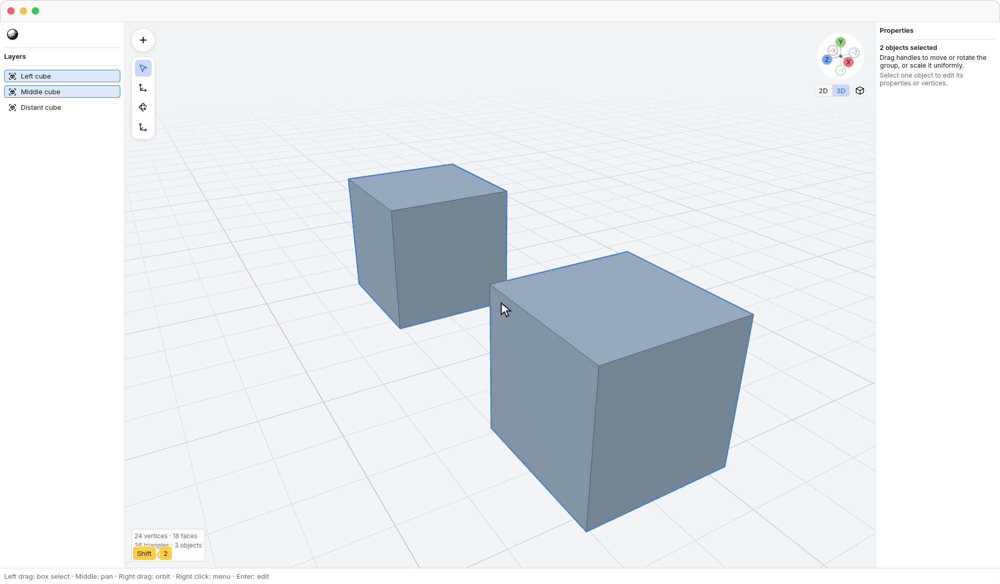
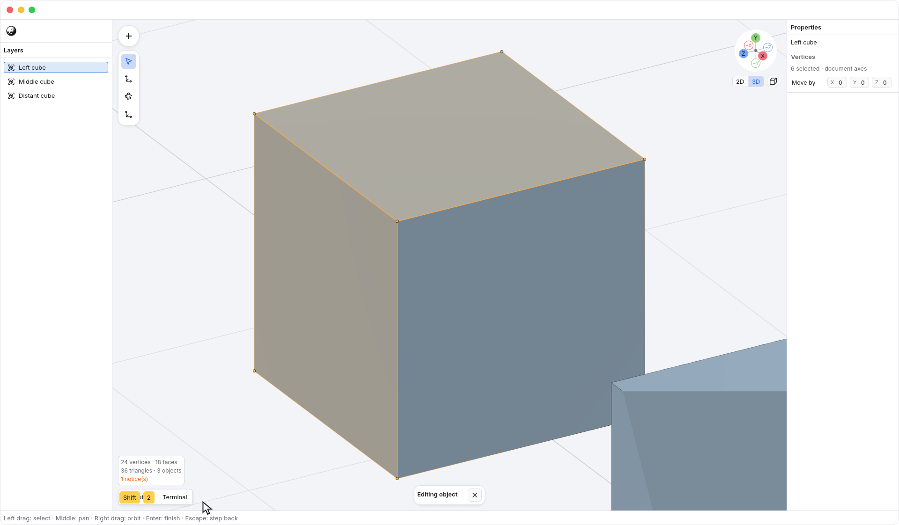

<!-- Generated by `just docs update`; edit docs/templates/*.md.in and src/documentation/scenarios/*.rs. -->

# Number keys and fitting the view

Outside a constrained transform, the top number row and numpad have separate
view bindings. When a Move, Rotate, or Scale axis is locked for a selection,
number keys enter an [exact transform amount](numeric-transforms.md) instead.
Finish or cancel that session to use the view shortcuts again.

| View        | Top row                       | Numpad                          |
| ----------- | ----------------------------- | ------------------------------- |
| Perspective | <kbd>1</kbd> | <kbd>Numpad 0</kbd> |
| Front       | <kbd>2</kbd>       | <kbd>Numpad 1</kbd>       |
| Right       | <kbd>3</kbd>       | <kbd>Numpad 3</kbd>       |
| Top         | <kbd>6</kbd>         | <kbd>Numpad 7</kbd>         |
| Back        | <kbd>4</kbd>        | —                               |
| Left        | <kbd>5</kbd>        | —                               |
| Bottom      | <kbd>7</kbd>      | —                               |

The dash means no direct preset binding in that column. All six orthographic directions
are available in <code>N3 → View</code>, including <code>N3 → View → Back</code>,
<code>N3 → View → Left</code>, and <code>N3 → View → Bottom</code>.
<kbd>0</kbd> on the top row toggles perspective and orthographic
projection without changing the viewing direction; <kbd>1</kbd>
selects the Perspective view preset.

Settled, aligned orthographic views also show the [2D ruler](2d-ruler.md)
along the top and left of the viewport.

<kbd>Numpad 4</kbd> / <kbd>Numpad 6</kbd> orbit left / right,
and <kbd>Numpad 2</kbd> / <kbd>Numpad 8</kbd> orbit down / up by
**15°**. <kbd>Numpad 5</kbd> toggles perspective and orthographic
projection without changing the viewing direction.

Use <kbd>Shift</kbd> + <kbd>1</kbd> to fit the whole document, just like <code>N3 → View → Frame</code> in <code>N3 → View</code>. It restores the default viewing angle and retains the
current projection mode.

Use <kbd>Shift</kbd> + <kbd>2</kbd> to center and fit the current selection. In
object mode, it includes every selected object and preserves your viewing
direction and projection. You can also right-click <code>Viewport</code> and
choose <code>Viewport → Frame selection</code>.

In vertex edit mode, <kbd>Shift</kbd> + <kbd>2</kbd> fits the selected vertices. A single selected
vertex is centered without changing the existing zoom. With nothing selected,
the view stays unchanged.

These view controls keep your geometry and selection unchanged and create no
undo steps. Text fields and menus retain their own keyboard controls.

See [navigation](navigation.md) or [selecting with keys](selection-keys.md).
[Back to guide](README.md).
