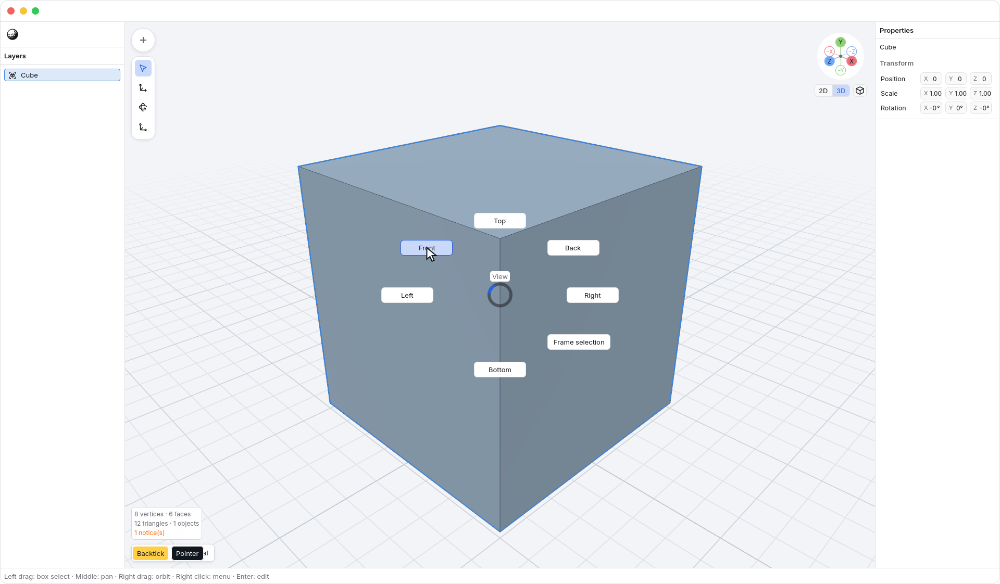
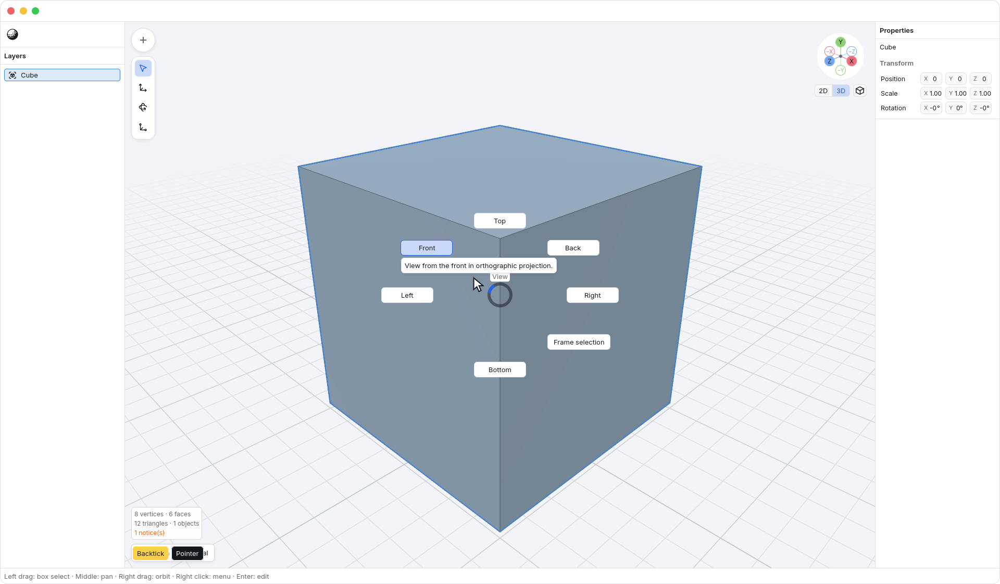

<!-- Generated by `just docs update`; edit docs/templates/*.md.in and src/documentation/scenarios/*.rs. -->

# Choosing a view with the pie

Move the pointer over <code>Viewport</code> and hold <kbd>`</kbd> to
open the view pie. Keep the key held while pointing at a choice, then release
the key to use it. You do not need to click.
The **View** name appears above the center. The choices face a circular opening,
with their buttons extending outward from it.
The ring's highlighted segment follows the pointer's direction, including empty sectors.
Pause in a choice's sector
to see its tooltip; you do not need to hover directly over the button.
Near a viewport edge, the pie can extend over the side panels; it stays inside
the window. Keep the key held to choose there too.

| Position    | Choice                         |
| ----------- | ------------------------------ |
| Top         | <code>View → Top</code>       |
| Upper left  | <code>View → Front</code>     |
| Upper right | <code>View → Back</code>      |
| Left        | <code>View → Left</code>      |
| Right       | <code>View → Right</code>     |
| Lower right | <code>View → Frame selection</code> |
| Bottom      | <code>View → Bottom</code>    |

The six direction choices switch to orthographic views using your current
view-animation settings. Frame selection centers and fits the selected geometry
while preserving your viewing direction and projection.
It works on selected objects in object mode and selected vertices in vertex
edit mode. The choice is disabled when that context has nothing selected.

Return to the opening point before releasing to cancel, or press <kbd>Escape</kbd>.
The empty lower-left slot also leaves the view unchanged. Hovering choices
does not preview a camera change. Your geometry, selection and current tool
stay unchanged, and choosing a view creates no undo step.

Text fields and other open menus keep their own keyboard input.

See [number keys and fitting the view](view-keys.md) or [navigation](navigation.md).
[Back to guide](README.md).
