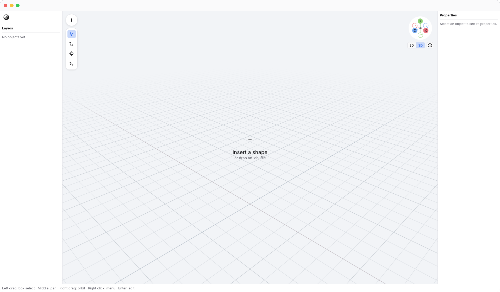
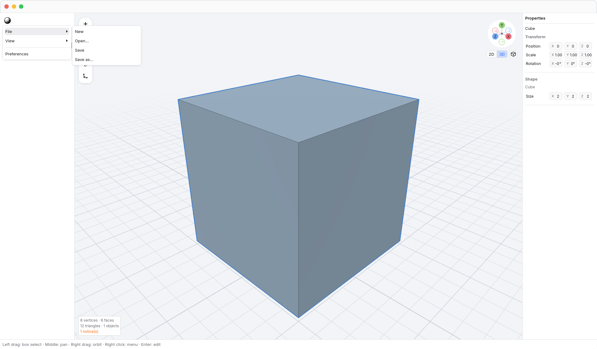
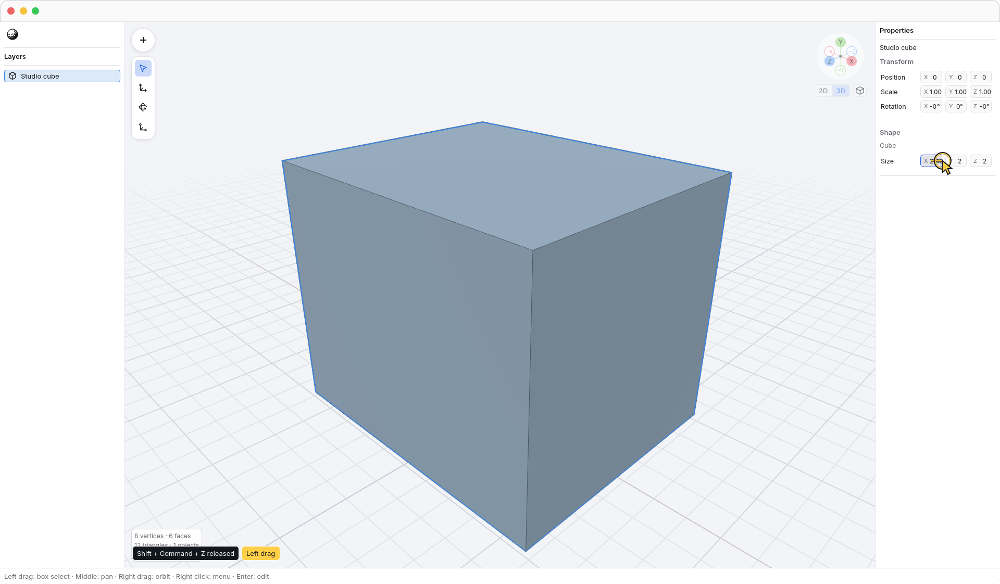
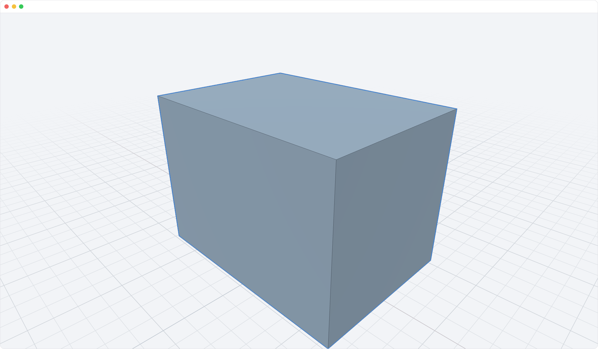

<!-- Generated by `just docs update`; edit docs/templates/*.md.in and src/documentation/scenarios/*.rs. -->

# Workspace layout and property editing

An empty 3D document offers a centered <code>Insert a shape</code> button.
Its circular background appears on hover or keyboard focus.
Click it to open the same Insert menu as the floating +, or drop an .obj file
into the viewport.

The N3 logo menu sits above Layers in the left panel. Open its <code>N3 → File</code>
submenu for file actions, or its <code>N3 → View</code> submenu for view controls.
Its compact rounded square feedback appears when you hover or focus it.
The N3 menu and both submenus have a comfortable minimum width of 208 points.
<code>Insert</code> is a floating + button at the viewport's upper left, with
the modeling tools stacked beneath it. Floating controls, menus, and Preferences
share the same soft shadow. In vertex edit mode, the exit bar appears
at the viewport's bottom center. Drag the borders of
<code>Layers</code> and <code>Properties</code> to resize those panels. Both start
at 240 pixels wide.
Full-width dividers separate the padded sections in Layers and Properties.
Cursor is selected when N3 starts, so you can select objects without showing
transform handles. Choose Move, Rotate, or Scale when you need their handles.
Layers shows a shape icon for each inserted primitive and a generic 3D object
icon for editable meshes. The whole row remains the selection target.
Square modeling-tool buttons in <code>Tools</code> keep their size
when hovered. Buttons and menus use the same rounded-corner scale.
Menu rows have an 8-point horizontal inset inside their hover background.
Dividers span the full menu width.
Submenu rows use a right-facing chevron.
Adjacent menu rows touch, so moving between commands has no empty hover gap.
Available keyboard shortcuts appear at the right of each action. Disabled
commands keep their shortcut hints; actions with no shortcut leave that space empty.
On macOS, modifier hints use ⌘ (Command), ⇧ (Shift), ⌥ (Option), and ⌃ (Control).
For example, <kbd>Shift</kbd> + <kbd>Command</kbd> + <kbd>S</kbd> appears compactly as
⇧⌘S in menus. Windows and Linux use names and separators,
such as Ctrl+Shift+S for that same action.
The guide keeps descriptive key names, and menu accessibility exposes those names
separately from the symbols.
<code>Scene information</code> shows mesh counts and notices at the viewport's lower
left when there is scene information to report, above <code>Tool Dock tab bar</code>.
The Tool Dock tab bar opens Animation or Terminal in the shared Tool Dock.
Choose <code>Tool Dock tab bar → Animation</code> to inspect animation, or read about the
[Terminal](terminal.md).
The <code>Status bar</code> is 32 points tall and keeps
interaction guidance visible along the bottom edge.

Open N3 to see File, View, and Preferences.
Menus support the keyboard even when opened with the mouse. Use
<kbd>Up</kbd> / <kbd>Down</kbd> or <kbd>Tab</kbd> / <kbd>Shift</kbd> + <kbd>Tab</kbd>
to move between available items. <kbd>Right</kbd> opens a submenu;
<kbd>Left</kbd> returns to its parent. <kbd>Enter</kbd> or <kbd>Space</kbd> activates
the focused item. <kbd>Escape</kbd> closes one menu level and returns focus when
the root menu closes. Disabled items and separators are skipped.

Properties uses compact sections. **Transform** keeps Position, Scale, and
Rotation in consistent rows, with X, Y, and Z fields side by side. A selected
primitive shows its existing size and shape parameters in **Shape**. The panel
still resizes; labels and controls retain their meaning as its width changes.

Double-click an object in Layers to open <code>Layers → Rename layer</code> with its name selected. Type a name
and press <kbd>Enter</kbd> to commit it. <kbd>Command</kbd> + <kbd>Z</kbd> reverses the rename; <kbd>Shift</kbd> + <kbd>Command</kbd> + <kbd>Z</kbd>
restores it.

Drag or type into a Properties value. The shape updates as the value changes,
including while the pointer remains held. Releasing the drag records one Undo
step for the full gesture. The same immediate preview applies to object
transform fields; no Apply button is needed.

Press <kbd>Command</kbd> + <kbd>\</kbd> to hide the interface and expand the viewport. Press it again
to restore the panels, toolbar, gizmo, 2D ruler, and scene information without
changing the model or selection.

[Back to guide](README.md).
