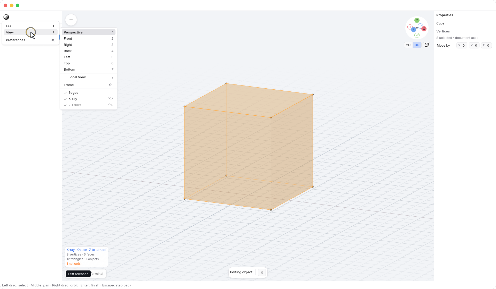
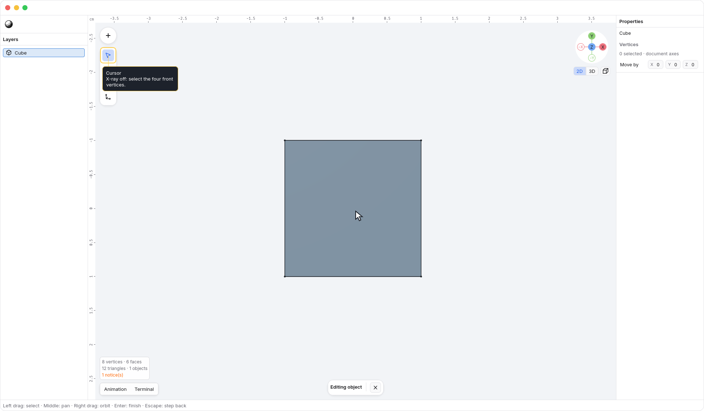
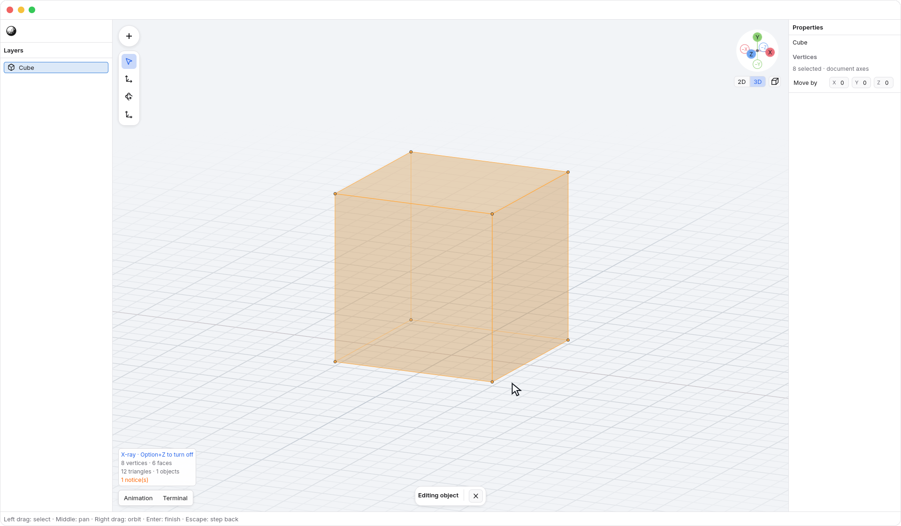
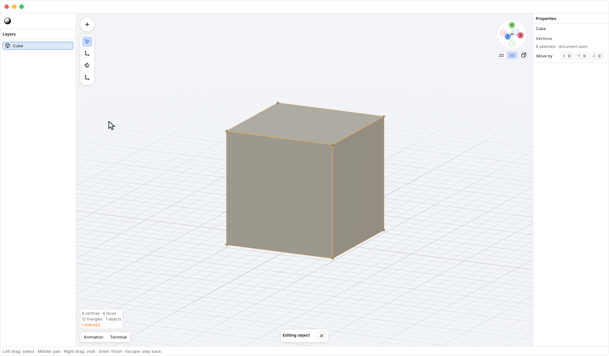
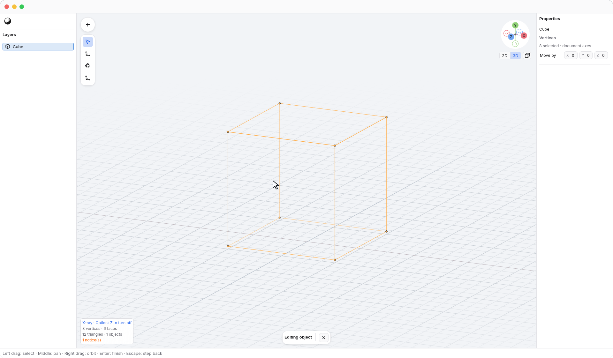

<!-- Generated by `just docs update`; edit docs/templates/*.md.in and src/documentation/scenarios/*.rs. -->

# Selecting through surfaces with X-ray

With <code>Viewport</code> focused, press <kbd>Option</kbd> + <kbd>Z</kbd> to toggle **X-ray**, or use
<code>N3 → View → X-ray</code>. X-ray starts off. Enable it when you want to select vertices
or objects behind surfaces without orbiting to expose them first.

## Select front and back together

Select an object and press <kbd>Enter</kbd> to enter vertex editing.
With <code>Tools → Cursor</code> active, drag a selection box around its vertices.
Selection changes when you release the pointer.

In Front view, the same box selects **4 vertices with X-ray
off** and **8 with X-ray on**. The back corners overlap the
front corners on screen, but both belong to the selection when X-ray is on.
After each selection, right-drag to orbit out of 2D: with X-ray off, the rear
corners are unselected; with it on, all eight corners remain selected. The
animation returns to Front with <kbd>2</kbd> before repeating the
same selection box.

Solid shading keeps faint surfaces to help you read the shape. Rear vertices and
edges appear more quietly than the front geometry. Orbit the view to see the
corners separately:

Clicking still selects one nearby vertex. When vertices share a screen position,
the nearer one wins; use a box to select both. <kbd>Shift</kbd>-click adds or
removes a vertex as usual. <kbd>Command</kbd> + <kbd>A</kbd> selects the edited object's
vertices inside the viewport, including those behind surfaces, and <kbd>Tab</kbd>
cycles through that same expanded set.

## Turning X-ray off keeps the selection

Press <kbd>Option</kbd> + <kbd>Z</kbd> again to restore ordinary depth and picking.
**Selected rear vertices stay selected.** They remain part of your next move,
rotate, scale, or delete, even when the surface hides their markers again.

## X-ray and shading are independent

[Wireframe](shading.md) removes filled surfaces; X-ray decides whether selection
can pass through them. You can use either shading mode with X-ray on or off.
Switching one does not change the other.

In object mode, a selection box can reach occluded objects with X-ray on.
An object click still chooses the nearest surface or edge.
[Local View](local-view.md) still limits which objects are available. In vertex
edit mode, X-ray reaches only the object you are editing.

Toggling X-ray does not change geometry, convert primitives to meshes, or add an
undo step. Text fields, open menus, and active pointer gestures keep ownership
of their input; finish that interaction before using the shortcut.

See [reading vertex selections](edit-selection.md) or [editing geometry](editing.md).
[Back to guide](README.md).
