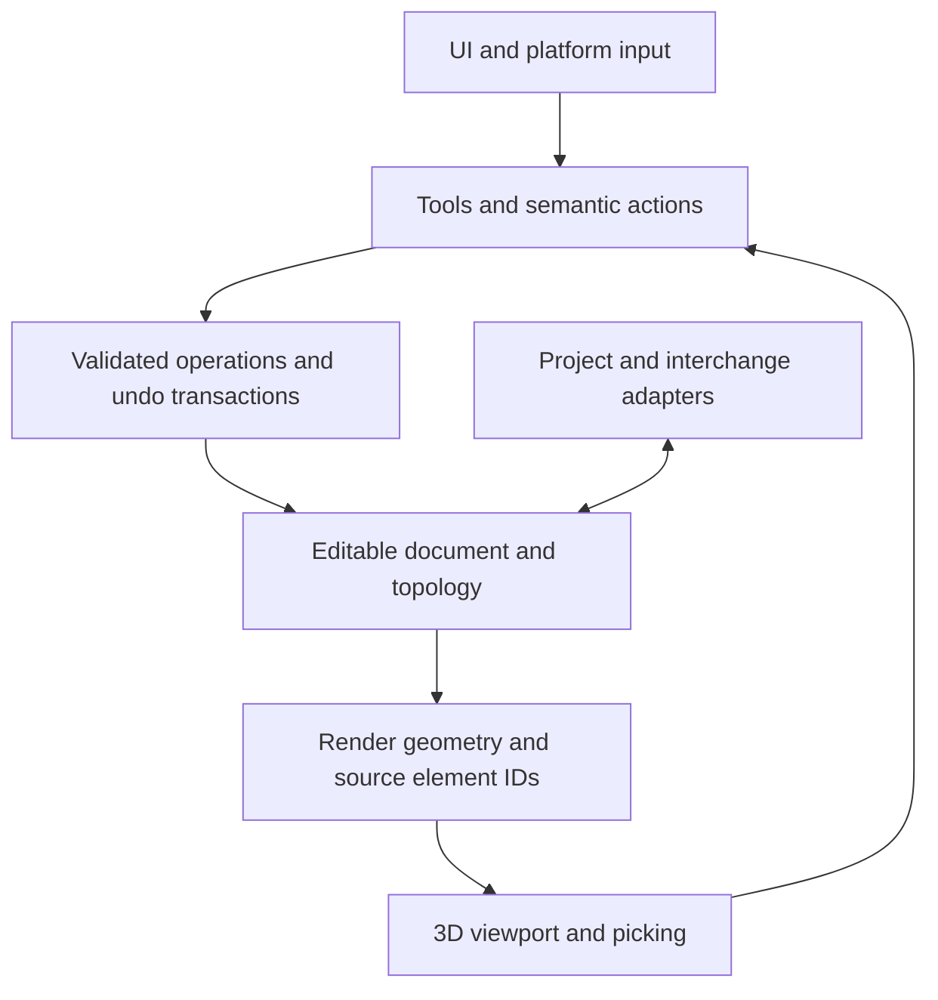

# Engineering foundations

Research draft, September 28, 2026. This is a component map and a shortlist for
discussion. wgpu is selected as the GPU foundation; the rest of the stack remains
open for the promoted application. Sources are official project documentation
and repositories. A local, ignored OBJ viewer now exercises a provisional subset
of these dependencies; see [Viewer spike](viewer-spike.md).

## Agreed direction

Rust; macOS first; a possible web version through WebAssembly later; a minimal
hard-surface V1; Blender as the modeling reference; no sculpting in V1.

Prefer low-level foundations and control over rendering and editing. Use wgpu
for portable GPU access. A higher-level scene engine is not required. Other
libraries remain provisional; using one in the viewer spike does not promote it
to the application architecture.

UI behavior and speculative assistance are recorded in [UX ideas](ux-ideas.md).
The current viewer-first scope and later editing questions are in [Pre-PoC](pre-poc.md).

## What is the 3D core?

There are several layers behind that phrase. A renderer consumes geometry to
draw an image. An editable topology structure records how vertices, edges, and
faces connect. Modeling operations change that structure and the coordinates.
The application adds selection, document state, transactions, and history.

The current brief points toward polygon mesh modeling. This is an inference from
the vertex/edge/face workflow, not a decision that follows automatically from
the phrase hard surface. A precision CAD kernel uses a different representation
of curves, surfaces, and solids. Choosing one changes the editing model.

## Abstraction level: Three.js, Skia, and wgpu

[Skia](https://skia.org/) provides a 2D drawing API.
[Three.js](https://threejs.org/manual/pages/fundamentals.html) provides a 3D
scene/rendering layer: cameras, meshes, materials, lights, and other facilities
above the GPU API. Neither analogy should be confused with an editable document
or modeling kernel.

[wgpu](https://github.com/gfx-rs/wgpu) sits lower, at the portable GPU API level.
It provides resources, pipelines, commands, and shader execution through native
backends such as Metal or browser WebGPU. It does not impose a scene graph or
material system. WGSL is the natural shader-language candidate for this route;
the graphics stack handles backend translation where needed.

Higher-level Rust renderers exist. [three-d](https://github.com/asny/three-d)
uses OpenGL/WebGL; [rend3](https://github.com/BVE-Reborn/rend3) is built on wgpu
and currently labels itself maintenance mode. The reviewed options do not give
us a reason to treat one as an automatic Three.js-equivalent choice.

Given the control preference and the selection of wgpu, the local spike implements
a small n3 viewport renderer. We own camera behavior, draw passes, and shading.
Picking and editing overlays remain future work. GPU rasterization and portable backend
integration are supplied below that layer. Reuse math and focused algorithms
where useful. This is a proposal to own the needed renderer, not to recreate a
general-purpose engine.

Control remains bounded by the API's supported features and device limits.
Direct Metal would expose different platform-specific capabilities, but would
introduce a separate portability problem for the possible web target.

## Components and ownership

| Component                | Responsibility                                                              | Reuse or build?                                                                  |
| ------------------------ | --------------------------------------------------------------------------- | -------------------------------------------------------------------------------- |
| Platform shell           | Window, event loop, Retina scaling, files, clipboard, application lifecycle | Reuse platform libraries; implement n3 integration.                              |
| UI                       | Panels, controls, text entry, layout, focus                                 | Evaluate a Rust toolkit; build the product UI.                                   |
| Viewport                 | Camera, shading, grid, edges, vertices, selection overlays                  | Reuse GPU access or a renderer; build modeling-specific rendering.               |
| Editable document        | Objects, transforms, mesh references, attributes, persistent identity       | Own its semantics and schema; reuse storage and serialization tools.             |
| Topology and geometry    | Connectivity, traversal, local edits, geometric calculations                | Evaluate a mesh library; own required invariants and operation behavior.         |
| Picking and selection    | Turn a pointer location into an object, face, edge, or vertex               | Reuse spatial-query primitives where useful; own selection rules and ID mapping. |
| Tools and commands       | Interactive preview, commit, cancel, validation, undo/redo                  | Build a shared operation path independent of keys and UI widgets.                |
| Persistence and exchange | Native project round-trips and Blender import/export                        | Own native schema; use established interchange formats and codecs.               |

Proposed responsibility flow:

These are logical boundaries. They do not require eight crates, a plugin system,
an ECS, or a procedural graph at the start.

## UI, shell, and GPU options

| Option                                                                              | What it offers                                                                                    | Main tradeoff to evaluate                                                                                              |
| ----------------------------------------------------------------------------------- | ------------------------------------------------------------------------------------------------- | ---------------------------------------------------------------------------------------------------------------------- |
| [egui + eframe](https://github.com/emilk/egui)                                      | Immediate-mode Rust UI and an application framework for native and web targets.                   | Small integration burden; confirm the input and platform hooks cover the intended Mac experience.                      |
| [egui + winit + egui-wgpu](https://github.com/emilk/egui/blob/main/ARCHITECTURE.md) | The same UI building blocks with an application-owned event loop and renderer lifecycle.          | More control over events and frame scheduling, with more integration code to maintain.                                 |
| [Iced](https://github.com/iced-rs/iced)                                             | Rust UI for native and web, organized around state, messages, update, and view.                   | A different application structure; its project still describes itself as experimental.                                 |
| [wgpu](https://wgpu.rs/)                                                            | GPU buffers, textures, shaders, render and compute passes; Metal on macOS and WebGPU in browsers. | Provides graphics infrastructure. We still implement the modeling viewport.                                            |
| [Bevy](https://github.com/bevyengine/bevy)                                          | An engine with ECS, scheduling, scene/assets, and rendering.                                      | Useful if those systems save enough work to justify adopting the engine architecture. Modeling operations remain ours. |

These are composable choices, not five interchangeable libraries. For example,
eframe can host egui and a custom wgpu viewport. egui's
[PaintCallback](https://docs.rs/egui/latest/egui/struct.PaintCallback.html) and
[official wgpu 3D example](https://github.com/emilk/egui/blob/main/crates/egui_demo_app/src/apps/custom3d_wgpu.rs)
show that integration. Iced provides a
[Shader widget](https://docs.rs/iced/latest/iced/widget/shader/index.html) for
custom GPU rendering too.

With the clarified control preference, prioritize evaluating our own wgpu
viewport. egui/eframe remains one possible host; an application-owned winit shell
offers more event-loop control. Iced is another UI option. Toolkit and shell
choices are separate from owning the renderer, and remain unselected.

egui draws its own controls; it is not AppKit. Native feel, menu behavior,
accessibility, focus, file dialogs, and trackpad behavior still deserve explicit
evaluation. A custom shell is not automatically necessary:
[eframe exposes input hooks](https://docs.rs/eframe/latest/eframe/trait.App.html).

For the future web target, keep platform input behind semantic actions such as
orbit, pan, zoom, rotate selection, and cancel. [winit's gesture events](https://docs.rs/winit/latest/winit/event/enum.WindowEvent.html)
have platform-specific availability. A successful wasm build alone will not
prove browser input, rendering, or file handling works.

wgpu's [platform matrix](https://github.com/gfx-rs/wgpu#supported-platforms)
distinguishes WebGPU support from its downlevel WebGL2 route. Browser capability
requirements should be chosen deliberately when that target becomes concrete.

## Editable topology: the consequential choice

An authored cube can have eight connected vertices and six quad faces. Rendering
it may require triangles and duplicated GPU vertices for hard normals or UV
seams. Those buffers must not define the user's editable topology or identity.

Blender's [BMesh design](https://developer.blender.org/docs/features/objects/mesh/bmesh/)
is the main structural reference: it stores vertices, edges, faces, and face
corners, and supports n-gons, wire edges, and non-manifold connectivity. Its
editing layers compose local changes into larger operations.

| Option                                            | Role                                                                                                | What would decide it?                                                                                                    |
| ------------------------------------------------- | --------------------------------------------------------------------------------------------------- | ------------------------------------------------------------------------------------------------------------------------ |
| [alum](https://github.com/ranjeethmahankali/alum) | Rust polygon half-edge mesh library with properties and low-level editing primitives. BSD-3-Clause. | Do its topology rules, handles, attributes, and mutation APIs support our required edit cases?                           |
| A small n3 topology core                          | Our own connectivity and edit primitives, informed by established structures such as BMesh.         | Justified if library constraints conflict with essential behavior; carries substantial correctness and maintenance work. |
| [truck](https://github.com/ricosjp/truck)         | Rust CAD kernel for curves/surfaces, B-rep solids, and tessellation. Apache-2.0.                    | Relevant if we choose precision surface/solid CAD. It is a different modeling direction.                                 |

alum is a candidate to test, not a complete modeling engine. Its
[editing contract](https://docs.rs/alum/latest/alum/trait.EditableTopology.html)
offers primitive operations, and distinguishes topological checks from geometric
quality. Its property storage follows element reordering; persistent editor IDs
and undo behavior still need evaluation. Its roadmap is driven by its author's
other projects, so maintenance fit is part of the decision.

One early representation question intersects the pen-tool idea: are incomplete
strokes separate draft paths, or loose edges in the editable mesh? Conventional
two-sided half-edge surface structures fit manifold surfaces and boundaries.
Arbitrary wire networks and edges incident to more than two faces require more
support. We should test these states instead of assuming a crate handles them.
Supporting every non-manifold configuration is not yet a V1 requirement.

Other libraries can help particular tasks later. [meshx](https://github.com/elrnv/meshx)
focuses on exchange and attributes and currently warns against production use;
[baby_shark](https://github.com/dima634/baby_shark) focuses on geometry processing,
including remeshing and booleans. Neither is established here as the primary
editor kernel.

## Supporting tools and engineering contracts

- **Math:** [glam](https://github.com/bitshifter/glam-rs) is a candidate for vectors,
  matrices, and quaternions. Choose coordinate conventions and CPU precision
  explicitly; they are not determined by the math crate or GPU buffer types.
- **Identity:** [slotmap](https://docs.rs/slotmap/latest/slotmap/) offers stable
  generational keys. It is one storage option, not a solution to preserving the
  meaning of a face after a split or merge. Operations must report replacements
  so selection and references can update.
- **Serialization:** [Serde](https://serde.rs/) can encode/decode our structures.
  The native schema, versioning, validation, and migrations remain ours.
- **Spatial queries:** [Parry](https://parry.rs/) is a possible source of ray and
  geometric queries. CPU queries and GPU ID picking are alternatives to measure.
  Edge and vertex selection still need screen-space tolerances and visibility
  rules; triangle hits alone do not define their behavior.

The most valuable application-owned contract is an operation that can be
validated, previewed, committed, cancelled, and undone. A drag should become one
meaningful transaction. Keyboard, gestures, future nodes, and optional assistance
can all call the same operations without being embedded in the geometry code.
This does not require committing to event sourcing or a node graph.

Define validity in layers: connected references and face boundaries; geometric
degeneracy and intersections; then application-specific allowed states. Clean
connectivity does not guarantee attractive edge flow or the intended shape.
Open boundaries can be intentional. Undo tests should restore topology,
attributes, IDs, and the promised selection state, not merely rendered positions.

## Standards and Blender interoperability

| Area               | Proposed boundary                                                                                                                                    |
| ------------------ | ---------------------------------------------------------------------------------------------------------------------------------------------------- |
| Native project     | When needed, a versioned n3 document that preserves editable topology and identity. Deferred from the proposed first mesh-only I/O milestone.        |
| glTF/GLB           | Standard exchange for finished meshes and materials; not an authoring-history format.                                                                |
| OBJ                | Proposed first mesh-only input/output format, preserving supported polygon faces. It does not retain a complete project or editor IDs.               |
| Coordinates        | Choose and document internal handedness, up axis, units, winding, transform order, and precision. Convert in adapters.                               |
| Shading attributes | Keep face-corner normals/UVs and sharp-edge intent distinct from geometric vertex connectivity.                                                      |
| Blender reference  | Study documented structures and operation behavior; test actual interoperability instead of assuming compatible terminology implies compatible data. |

The [glTF specification](https://registry.khronos.org/glTF/specs/2.0/glTF-2.0.html)
targets runtime delivery and excludes authoring information. It defines a
right-handed Y-up system with meters and radians. Blender's
[glTF exporter](https://docs.blender.org/manual/en/latest/addons/import_export/scene_gltf2.html)
triangulates polygon faces and may split vertices at shading/UV discontinuities.
An export/import cycle cannot promise recovery of the original authored mesh.

Blender's [OBJ documentation](https://docs.blender.org/manual/en/4.1/files/import_export/obj.html)
describes polygon exchange, UVs, normals, and the absence of parenting and
transform representation. Neither glTF nor OBJ should silently become n3's
native editable document.

For the first mesh-only stage, OBJ can still be the sole on-disk format while
the editable in-memory model remains ours. This is the current recommendation
in the [pre-PoC proposal](pre-poc.md), not an agreed format selection. Persistent
project state can justify a native schema later.

Direct .blend support would be a separate integration project: Blender's
[DNA structures](https://developer.blender.org/docs/features/core/dna/) and
[version-conversion logic](https://developer.blender.org/docs/handbook/guidelines/compatibility_handling_for_blend_files/)
go beyond a simple interchange reader. Also, this repository currently uses MIT;
Blender's [source licensing](https://www.blender.org/about/license/) must be
considered separately from studying its architecture or exchanging model files.

## How to choose, without selecting everything at once

First compare representation constraints on paper. Then use small, disposable
engineering evaluations to answer specific uncertainties:

1. **Topology:** cube and open polygon; split/join, extrusion, deletion, and a
   draft path. Include concave/non-planar input, failure rollback, attributes,
   stable references, and undo/redo. Use these to evaluate alum against the
   requirements an owned core would need to satisfy.
2. **Platform and viewport:** one selectable cube with readable vertices/edges;
   Retina resize, camera motion, Mac trackpad events, keyboard focus, and cancel.
   Compare only the shell/toolkit candidates still under consideration.
3. **Portability and data:** compile the proposed core dependency set for wasm,
   test the proposed OBJ geometry round-trip, and inspect a known-size model in
   Blender. Browser execution is separate proof when a web slice is introduced.

The evaluation sequence is a proposal, not work already performed. Versions,
performance, correctness, platform behavior, and dependency maintenance still
need verification before adoption. The first decision to discuss is the editable
mesh representation and required intermediate states; the UI toolkit can be
evaluated independently.
